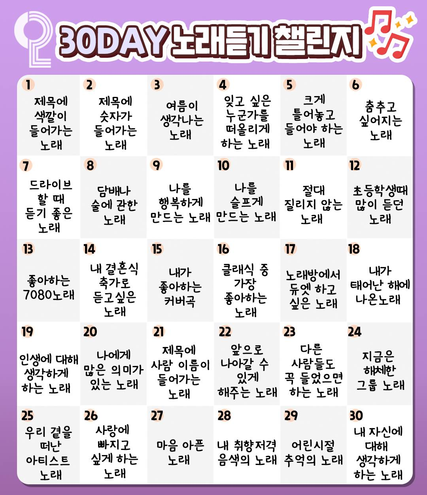

## 1. 제목에 색깔이 들어가는 노래

<iframe width="560" height="315" src="https://www.youtube.com/embed/VRR6Fvnp5h4" title="YouTube video player" frameborder="0" allow="accelerometer; autoplay; clipboard-write; encrypted-media; gyroscope; picture-in-picture" allowfullscreen></iframe>

**강수지 - 보라빛 향기**

## 2. 제목에 숫자가 들어가는 노래

<iframe width="560" height="315" src="https://www.youtube.com/embed/6KmeldG_uFM" title="YouTube video player" frameborder="0" allow="accelerometer; autoplay; clipboard-write; encrypted-media; gyroscope; picture-in-picture" allowfullscreen></iframe>

**룰라 - 3!4!**

숫자 들어간 노래 하면 당연히 떠오르는 노래!

## 3. 여름이 생각나는 노래

<iframe width="560" height="315" src="https://www.youtube.com/embed/rLk_952ZHDU" title="YouTube video player" frameborder="0" allow="accelerometer; autoplay; clipboard-write; encrypted-media; gyroscope; picture-in-picture" allowfullscreen></iframe>

**박명수 - 바다의 왕자**

현 여당의 전 원내대표인 그 분이 부른 영상이 떠오른다 ㅋㅋ

## 4. 잊고 싶은 누군가를 떠올리게 하는 노래

<iframe width="560" height="315" src="https://www.youtube.com/embed/JEo7FZuBr9o" title="YouTube video player" frameborder="0" allow="accelerometer; autoplay; clipboard-write; encrypted-media; gyroscope; picture-in-picture" allowfullscreen></iframe>

**펀치 - 밤이 되니까**

새벽 감성 레전드 노래

## 5. 크게 틀어놓고 들어야 하는 노래

<iframe width="560" height="315" src="https://www.youtube.com/embed/UceaB4D0jpo" title="YouTube video player" frameborder="0" allow="accelerometer; autoplay; clipboard-write; encrypted-media; gyroscope; picture-in-picture" allowfullscreen></iframe>

**Post Malone - Rockstar**

미친듯이 울려대는 베이스 소리를 감상하기 위해서 크게 틀어야 한다.

## 6. 춤추고 싶어지는 노래

<iframe width="560" height="315" src="https://www.youtube.com/embed/zIh5AHxh-Ok" title="YouTube video player" frameborder="0" allow="accelerometer; autoplay; clipboard-write; encrypted-media; gyroscope; picture-in-picture" allowfullscreen></iframe>

**LMFAO - Party Rock Anthem**

셔플댄스 붐을 일으킨 그 노래!

## 7. 드라이브 할 때 듣기 좋은 노래

<iframe width="560" height="315" src="https://www.youtube.com/embed/oygrmJFKYZY" title="YouTube video player" frameborder="0" allow="accelerometer; autoplay; clipboard-write; encrypted-media; gyroscope; picture-in-picture" allowfullscreen></iframe>

**Dua Lipa - Don't Start Now**

야무진 베이스라인

## 8. 담배나 술에 관한 노래

<iframe width="560" height="315" src="https://www.youtube.com/embed/1KFQdzSbbKA" title="YouTube video player" frameborder="0" allow="accelerometer; autoplay; clipboard-write; encrypted-media; gyroscope; picture-in-picture" allowfullscreen></iframe>

**임재현 - 조금 취했어**

노래방 가면 항상 부르는 곡이었다. 하도 많이 불러서 곡 번호도 기억한다 98888번 ㅋㅋ

## 9. 나를 행복하게 만드는 노래

<iframe width="560" height="315" src="https://www.youtube.com/embed/RmlHTCeNPQk" title="YouTube video player" frameborder="0" allow="accelerometer; autoplay; clipboard-write; encrypted-media; gyroscope; picture-in-picture" allowfullscreen></iframe>

**경서 - 넌 내꺼야**

원곡자가 본인의 곡을 커버한 영상.

## 10. 나를 슬프게 만드는 노래

<iframe width="560" height="315" src="https://www.youtube.com/embed/n78Gg6_zEQg" title="YouTube video player" frameborder="0" allow="accelerometer; autoplay; clipboard-write; encrypted-media; gyroscope; picture-in-picture" allowfullscreen></iframe>

**Jake Hill & Josh A - Suicidal Thoughts**

힘들 때 많이 들었던 노래, powfu 특유의 슬픈 느낌이 좋다.

## 11. 절대 질리지 않는 노래

<iframe width="560" height="315" src="https://www.youtube.com/embed/kbYbvDK-HlY" title="YouTube video player" frameborder="0" allow="accelerometer; autoplay; clipboard-write; encrypted-media; gyroscope; picture-in-picture" allowfullscreen></iframe>

**Mike Perry - Inside the Lines**

얼마 전에 Mike Perry 내한 공연 했는데 ㅠㅠ 수능을 목전에 둔 고3은 웁니다

## 12. 초등학생 때 많이 듣던 노래

<iframe width="560" height="315" src="https://www.youtube.com/embed/psXpwLgBDW8" title="YouTube video player" frameborder="0" allow="accelerometer; autoplay; clipboard-write; encrypted-media; gyroscope; picture-in-picture" allowfullscreen></iframe>

**걸스데이 - Something**

남자들 환호하는 소리 레전드 ㅋㅋㅋ

## 13. 좋아하는 7080 노래

<iframe width="560" height="315" src="https://www.youtube.com/embed/a0Q0bV2itxs" title="YouTube video player" frameborder="0" allow="accelerometer; autoplay; clipboard-write; encrypted-media; gyroscope; picture-in-picture" allowfullscreen></iframe>

**다섯손가락 - 풍선**

7080 노래는 나에게 너무 멀다.. 당장 생각나는 노래는 이 노래다!

## 14. 내 결혼식 축가로 듣고싶은 노래

<iframe width="560" height="315" src="https://www.youtube.com/embed/--knPjoSlNE" title="YouTube video player" frameborder="0" allow="accelerometer; autoplay; clipboard-write; encrypted-media; gyroscope; picture-in-picture" allowfullscreen></iframe>

**마크툽,구윤회 - Marry Me**

어쩌면 너무 뻔한 노래일지도?

## 15. 내가 좋아하는 커버곡

<iframe width="560" height="315" src="https://www.youtube.com/embed/ZWgk79cnA2M" title="YouTube video player" frameborder="0" allow="accelerometer; autoplay; clipboard-write; encrypted-media; gyroscope; picture-in-picture" allowfullscreen></iframe>

**펀치 - 맞아 잠을 설친 건 너 때문이야**

## 16. 클래식 중 가장 좋아하는 노래

<iframe width="560" height="315" src="https://www.youtube.com/embed/algM0c_u99k" title="YouTube video player" frameborder="0" allow="accelerometer; autoplay; clipboard-write; encrypted-media; gyroscope; picture-in-picture" allowfullscreen></iframe>

**Frédéric Chopin - Waltz in A minor, B 150, Op. Posth**

단조롭고 단순한 멜로디에서 이렇게 아름다운 소리를..

## 17. 노래방에서 듀엣하고 싶은 노래

<iframe width="560" height="315" src="https://www.youtube.com/embed/OKtMZvukAM4" title="YouTube video player" frameborder="0" allow="accelerometer; autoplay; clipboard-write; encrypted-media; gyroscope; picture-in-picture" allowfullscreen></iframe>

**서인국, 정은지 - All For You**

노래방에서 이미 불러봤긴 하지만 은근히 높아서 어렵다

## 18. 내가 태어난 해에 나온 노래

<iframe width="560" height="315" src="https://www.youtube.com/embed/BxsSmAXRaXo" title="YouTube video player" frameborder="0" allow="accelerometer; autoplay; clipboard-write; encrypted-media; gyroscope; picture-in-picture" allowfullscreen></iframe>

**신화 - 열병**

지금 들어도 여전히 멋진 노래!

## 19. 인생에 대해 생각하게 하는 노래

<iframe width="560" height="315" src="https://www.youtube.com/embed/OzCaD88h8tk" title="YouTube video player" frameborder="0" allow="accelerometer; autoplay; clipboard-write; encrypted-media; gyroscope; picture-in-picture" allowfullscreen></iframe>

**윤종신 - 오르막길**

## 20. 나에게 많은 의미가 있는 노래

<iframe width="560" height="315" src="https://www.youtube.com/embed/DVQOazBqfEU" title="YouTube video player" frameborder="0" allow="accelerometer; autoplay; clipboard-write; encrypted-media; gyroscope; picture-in-picture" allowfullscreen></iframe>

**윤종신 - 지친 하루**

## 21. 제목에 사람 이름이 들어가는 노래

<iframe width="560" height="315" src="https://www.youtube.com/embed/uwwxXEXvB4g" title="YouTube video player" frameborder="0" allow="accelerometer; autoplay; clipboard-write; encrypted-media; gyroscope; picture-in-picture" allowfullscreen></iframe>

**하은 - 신용재**

## 22. 앞으로 나아갈 수 있게 해주는 노래

<iframe width="560" height="315" src="https://www.youtube.com/embed/P8b47hZdvVY" title="YouTube video player" frameborder="0" allow="accelerometer; autoplay; clipboard-write; encrypted-media; gyroscope; picture-in-picture" allowfullscreen></iframe>

**Panic! At the Disco - High Hopes**

## 23. 다른 사람들도 꼭 들었으면 하는 노래

<iframe width="560" height="315" src="https://www.youtube.com/embed/FVftpgsfw1o" title="YouTube video player" frameborder="0" allow="accelerometer; autoplay; clipboard-write; encrypted-media; gyroscope; picture-in-picture" allowfullscreen></iframe>

**헤이즈, 펀치 - 밤하늘의 저 별처럼**

좋아하는 가수 두 명이 같이 부른 노래다.

## 24. 지금은 해체한 그룹 노래

<iframe width="560" height="315" src="https://www.youtube.com/embed/VLi1iVUWN7Q" title="YouTube video player" frameborder="0" allow="accelerometer; autoplay; clipboard-write; encrypted-media; gyroscope; picture-in-picture" allowfullscreen></iframe>

**씨스타 - Touch My Body**

여름하면 씨스타, 씨스타하면 여름이던 그 시절 많이 듣던 노래

## 25. 우리 곁을 떠난 아티스트 노래

<iframe width="560" height="315" src="https://www.youtube.com/embed/vQ3XgMKAgxc" title="YouTube video player" frameborder="0" allow="accelerometer; autoplay; clipboard-write; encrypted-media; gyroscope; picture-in-picture" allowfullscreen></iframe>

**Avicii - Lonely Together**

RIP Avicii

## 26. 사랑에 빠지고 싶은 노래

<iframe width="560" height="315" src="https://www.youtube.com/embed/4jIjTPgDzMk" title="YouTube video player" frameborder="0" allow="accelerometer; autoplay; clipboard-write; encrypted-media; gyroscope; picture-in-picture" allowfullscreen></iframe>

**김조한 - 사랑에 빠지고 싶다**

말 그대로 사랑에 빠지고 싶은 노래다.

## 27. 마음 아픈 노래

<iframe width="560" height="315" src="https://www.youtube.com/embed/r3ocmQhc9is" title="YouTube video player" frameborder="0" allow="accelerometer; autoplay; clipboard-write; encrypted-media; gyroscope; picture-in-picture" allowfullscreen></iframe>

## 28. 내 취향저격 음색의 노래

<iframe width="560" height="315" src="https://www.youtube.com/embed/gY3RvDNFFx8" title="YouTube video player" frameborder="0" allow="accelerometer; autoplay; clipboard-write; encrypted-media; gyroscope; picture-in-picture" allowfullscreen></iframe>

**보라미유, MJ(써니사이드) - 통화연결음**

## 29. 어린시절 추억의 노래

<iframe width="560" height="315" src="https://www.youtube.com/embed/iVt3BY2diaw" title="YouTube video player" frameborder="0" allow="accelerometer; autoplay; clipboard-write; encrypted-media; gyroscope; picture-in-picture" allowfullscreen></iframe>

**처진 달팽이(유재석, 이적) - 압구정 날라리**

## 30. 내 자신에 대해 생각하게 하는 노래

<iframe width="560" height="315" src="https://www.youtube.com/embed/U3e4AOd-DzE" title="YouTube video player" frameborder="0" allow="accelerometer; autoplay; clipboard-write; encrypted-media; gyroscope; picture-in-picture" allowfullscreen></iframe>

**옥상달빛 - 수고했어 오늘도**
