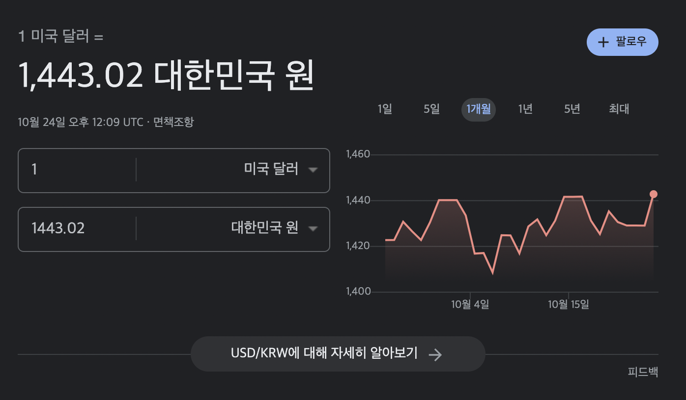

# 서문

필자는 음악 스트리밍 서비스로 Spotify와 Tidal을 사용하고 있었다. 그러나 Tidal의 Master 음원의 소리를 온전히 들을 만한 오디오 장비가 없고, 음악 추천 알고리즘이 Spotify가 더 낫다고 판단하여 6개월 간 친구와 가족 요금제로 사용한 Tidal을 탈퇴하기로 했다.

Tidal 요금제를 간단히 설명해보자면, 미국 달러 기준으로 HiFi 요금제는 월 19.99 달러로, 현재 환율 기준 28845원이다. 음악 스트리밍에 이 돈을 지불하는 것은 너무 과하다고 생각한다. 이때 팁이 있는데, Tidal을 아르헨티나 국적으로 가입해서 사용하면, 월 1200원 정도로 HiFi 요금제를 사용할 수 있다. 아르헨티나 화폐 가치가 빠른 속도로 떨어지고 있고 그 결과 굉장히 저렴한 가격으로 Master 음원을 즐길 수 있다. 본인은 이러한 방법으로 6개월 간 Tidal을 사용해왔다.

그러나 앞서 언급했듯 Tidal의 활용도가 나에게는 떨어진다고 생각해서 이 참에 예전에 사용하던 Spotify로 다시 돌아가기로 했다.

# Spotify는 무료!

한국과 대만을 제외한 모든 국가에서 무료로 사용할 수 있는 요금제가 있다. 단 노래 사이사이에 광고가 들어가있고 최고 160kbps 음질로 들을 수 있다. 국적을 우회해서 무료 요금제로 가입하고 나면, 데스크탑 클라이언트로 들을 때는 2주에 한 번씩 가입한 국가로 IP를 우회해주자. 웹 플레이어로 들을 때는 필요 없다. 또한 모바일에서 들을 때는 다음 곡으로 넘기는 것이 시간 당 6회로 제한된다. 그러나 이러한 제약 사항들을 무시하고 무료로 프리미엄에 준하는 경험을 할 수 있는 방법을 소개하겠다.
