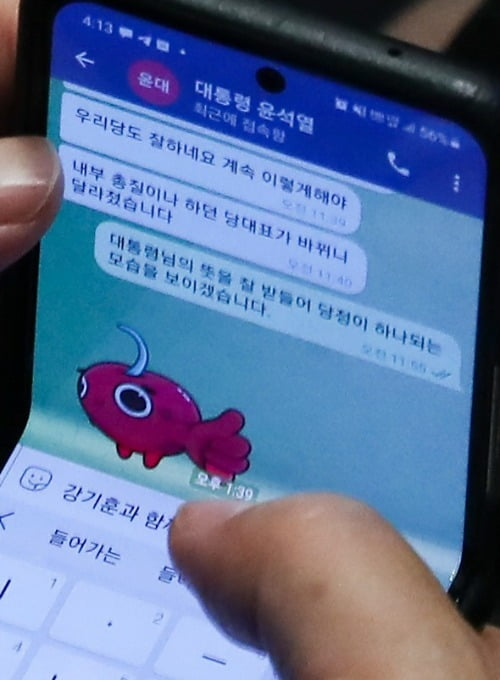

# 서문

일상생활을 하며 진짜 자신의 모습과 인터넷을 분리, 또는 인터넷 세상에서 자신을 숨기고 싶을 때, 심지어 불법적인 행위를 할 때 꼭 신경써야 할 것이 보안이다. 인터넷 공간은 우리가 생각하는 것 그 이상으로 위험하다. 언제 어떤 웹사이트를 접속했는지는 물론 어떤 기기로 접속했는지, 나의 관심사, 위치 정보 등 수많은 데이터들이 영구적으로 데이터 수집 회사에 남아 데이터 브로커들에게 판매된다. 우리의 개인 정보들이 어딘가에서는 돈이 되고 있다는 것이다.

뿐만 아니라 보안이라는 것이 온라인 상의 것들이 아닌 실제 물리적인 요소에도 작용하기 때문에 이 글에서는 시도하기 쉬운 순서대로 물리적으로 자신의 보안을 지키는 방법부터 궁극적으로 인터넷 상에서 정체를 숨기는 방법까지 설명하겠다.

그 방법이 방대하며 구체적이기에 글은 수시로 업데이트 될 것이다.

# 보안 1단계

1단계는 일상생활에서 누구나 쉽게 따라할 수 있고 큰 도움이 되는 방법이다. 주로 물리적인 요소를 다룬다.

## 중요한 자료는 잠금 및 분리

컴퓨터가 해킹을 당하여 기밀 파일들이 유출되는 것을 방지하기 위해 중요한 자료는 반드시 컴퓨터 대신 인터넷과 단절되어 있는 콜드 저장장치에 저장해두자. 여기서 지문 인식 또는 홍채 인식 기능이 탑재 된 보안 USB를 사용하면 타인이 자료에 접근할 수 없는 장점이 있다.

## GPS 끄기

스마트폰에서 GPS 기능을 켜면 통신사에서 나의 위치를 수집하기 때문에 보안에 좋지 않다. 심지어 구글에서 나의 위치 기록을 수집하고 저장하는데, 해당 기능만큼은 반드시 꺼두어야 한다. GPS가 꺼져있으면 유사 시 기지국을 기반으로 위치 추적을 하기 때문에 위치가 덜 정확하게 잡힐 뿐이다. 완전히 위치를 수집하지 못하는 것은 아니지만 그래도 나의 위치로 추정되는 공간이 커지게 되는것 만으로 보안에 좋다.

## 본체 잠금

기밀 자료가 저장된 PC의 하드디스크를 누군가가 적출해가는 경우를 대비하여 본체에 잠금장치를 걸어두자. 하드 디스크를 다른 PC에 연결하면 어떤 파일이 들어있는지 확인할 수 있기 때문이다. 아래의 상품을 참고해보자.

[컴퓨터 데스크탑 잠금 케이스 본체 보호상자 USB 잠금 - 인터파크](https://shopping.interpark.com/product/productInfo.do?prdNo=8330854689)

다만 문제점은 잠금 장치를 부숴서 하드 디스크를 적출할 경우 무용지물이 된다. 이를 대비한 더 안전한 방법은 보안 3단계에서 소개하겠다.

## 보안 필름

스마트폰과 노트북에 보안 필름을 붙히는 것도 물리적인 보안에 도움이 된다. 보안 필름을 붙이면 정면에서 바라보지 않는 한 화면이 거의 보이지 않게 되어 보안에 좋지만 시야각이 급감하는 단점이 있다.

# 보안 2단계

이제 본격적으로 온라인 상에서 안전하게 생활하는 방법을 소개하는 단계이다. 회원 가입 시 주의사항을 다룬다.

## 안전한 비밀번호

모두가 아는 사실이지만 안전한 비밀번호를 생성하는 것이 중요하다. 현대의 슈퍼컴퓨터들은 너무 강력하여 단순히 영어 알파벳과 숫자 몇 개로만 이루어진 비밀번호를 사용했다가는 쉽게 bruteforce (무차별 대입) 공격에 당할 수 있다. 당신이 사용하는 비밀번호가 뚫리는데 얼마나 시간이 걸리는지 알아보고 싶으면 아래의 링크를 참고하자. 

[How Secure Is My Password? | Password Strength Checker](https://www.security.org/how-secure-is-my-password/)

각 사이트마다 다르게, 25자리 이상, 영어 대소문자, 숫자, 특수문자를 모두 포함한 문자열정도는 되어야 안전한 비밀번호라고 할 수 있다. 그러나 현실적으로 이를 모두 기억하는 것은 불가능하기 때문에 1Password, LastPass와 같은 패스워드 매니저 프로그램 사용을 추천한다. 이런 프로그램들은 보안성이 뛰어난 비밀번호를 랜덤으로 생성해주고 자동 저장을 하기 때문에 아무리 어려운 비밀번호를 사용해도 로그인하는데 문제가 없다.

## 여러 이메일 만들기

이메일을 여러 개 만들기만 해도 보안에 꽤 도움이 된다. 예를 들어, 개인적인 이메일을 주고 받을 계정, 쇼핑 사이트에 사용할 계정, 업무에 사용할 계정 등 사용 용도에 따라 분류하는 것이다. 만약 당신이 이메일 계정을 하나만 갖고 있다면, 해당 메일이 해킹당했을 경우 개인적인 내용, 쇼핑 내역, 업무 기밀 사항 등 모든 것들이 유출된다. 그러나 이를 분류시켜두면 더 많은 자료들의 유출을 방지할 수 있다. 다만 각 계정마다 비밀번호를 규칙성이 없도록 다르게 설정해야 하고 용도 분류를 확실하게 해야 한다.

## 임시 이메일 활용하기

개인적인 내용이 담긴 이메일을 수신해야 하거나 본인이 메일을 발신할 용도가 아니고, 웹사이트에 회원 가입을 할 때 단순히 본인 확인용의 이메일이 필요하다면 임시 이메일 서비스를 사용하는 것을 추천한다.

# 보안 3단계

보안 3단계는 리눅스에 대한 이해도가 조금 필요하다.

## 리눅스 사용

Windows 운영체제는 가장 흔히 사용되는 OS인 만큼 각종 악성코드에 매우 취약하다. 또한 오픈 소스가 아니기에 취약점 발생 시 빠른 대처가 어렵다. 그래서 리눅스를 사용하는 것 만으로도 바이러스 예방에 도움이 된다. 리눅스에서 LibreOffice로 각종 오피스 툴을 사용할 수 있고, Wine을 활용하면 Windows에서만 구동되는 프로그램을 돌릴 수 있다. 영상 편집은 리눅스에서 사용 가능한 Kdenlive 등을 활용하면 된다. 리눅스에 한번 적응하고 나면 크게 불편함은 없다.

## LUKS

하드디스크를 적출당할 때를 대비하여 리눅스의 LUKS를 사용하자. LUKS는 디스크 전체를 안전하게 암호화하기 때문에 본인의 하드디스크를 다른 PC에 연결해도 어떤 파일이 들어있는 지 확인할 수 없다. 비슷한 기능으로는 WIndows의 Bitlocker, macOS의 Filevault가 있다. LUKS 자세한 사용 방법은 아래 링크를 참고하자. 

[[데비안] 리눅스 디스크/파티션 LUKS로 암호화하기](https://sacstory.tistory.com/entry/%ED%95%98%EB%93%9C-%EC%B6%94%EA%B0%80%EC%8B%9C)

# 보안 4단계

보안 4단계는 웹에 대한 이해도가 조금 필요하다.

## 트래커 차단

트래커란 쉽게 설명하자면 이렇다. 당신이 새로운 게이밍 모니터를 구매하고 싶어 유튜브에서 관련 후기를 검색했다. 그러면 유튜브에 딸려 있는 트래커가 이를 수집하여 웹서핑을 할 때 해당 모니터를 판매하는 쇼핑몰 사이트 광고를 내보낸다. 이렇게 인터넷에서 우리가 무엇을 하고 있는지 데이터 수집 회사는 다 알고 있고, 나의 행적을 브로커에게 팔아 남겨 수익을 창출한다. 실제로 미국에서 Donald Trump가 대통령에 당선되기 위해 데이터 회사에게 돈을 지불, 그를 지지하지 않는 시민들에게 트럼프 관련 광고들이 나오게 유도하였다. 그렇게 지지율을 높여 당선에 성공할 수 있었다.

자동으로 트래커들을 차단해주는 Brave 브라우저를 사용하자. Chromium 기반 브라우저여서 사용하는데 큰 불편함이 없고 비트코인과 같은 가상화폐 사용이 간편하게끔 브라우저에 가상화폐 지갑이 내장되어있어 (brave wallet) 유용하다.

## 익명 검색엔진

앞서 설명했듯 구글에는 수많은 트래커들이 붙어있기 때문에 로그아웃 상태에서 검색을 한다고 해도 전혀 안전하지 않다. 따라서 트래커가 없고 사생활 보호를 중시하는 검색엔진인 startpage, duckduckgo를 사용하는 것을 권장한다.

## VPN

VPN이란 본래 회사에서 업무의 효율의 증진하기 위한 도구로 사용되었는데, 네트워크 외부에서 사내 인트라넷에 접근할 수 있도록 하는 사설 통신망이다. VPN의 터널링 기술 덕분에 기기와 라우터까지의 통신 기록이 암호화되기 때문에 패킷을 열어보기 힘들고, IP가 우회되어 현재는 대부분 프록시 서버로서 사용되고 있다.

VPN 사용 시 주의해야 할 점이 있다면 절대로 무료 VPN을 사용해서는 안된다. 무료 VPN은 트래커와 비슷하게 IP와 방문 기록 등 사용자의 개인정보를 판매하여 수익을 내는 방식이다.

## 익명 메신저

일단 카카오톡은 절대 사용하지 말자. 사용자들이 주고받는 대화를 수집하여 챗봇 학습에 사용한다는 것이 말이 되는가? 한 때 화제된 챗봇 ‘이루다’의 경우를 보아라. 20대 여성의 카톡 1억 건을 10년 동안 수집했다고 하니 전혀 말이 되지 않는다. 특히 국내 서비스들은 이렇게 다른 기업이나 정부에 개인정보들을 넘겨주는 사례가 많기 때문에 신뢰도가 매우 떨어진다.

따라서 메신저는 종단 간 암호화 기술 (P2PE) 이 탑재된 메신저를 사용하자. 대표적으로 텔레그램. 정치인과 범죄자들이 텔레그램을 사용하는 이유는 너무나도 잘 알려져 있다. 텔레그램이 안전하다는 것은 모두가 알고 있을 것이다. 그러나 필자는 개인정보 보호를 중시한다면 텔레그램 보다는 시그널 (Signal) 을 추천한다.

|  | 시그널 | 텔레그램 |
| --- | --- | --- |
| 암호화 | 오픈소스 프로토콜 | MTProto2.0 (일부는 오픈소스 아님) |
| 수집 데이터 | 전화번호 | 이름, 전화번호, 연락처, IP (위치, 누구와 언제 대화했는지 수집) |
| 메시지 유형 | 개인, 단체 (최대 1000명), 영상, 음성 | 개인, 그룹 (최대 20만명), 채널, 영상, 음성 |
| P2PE | 모든 채팅에 적용 | 비밀 채팅에만 적용 |

시그널은 위 표에서 보다시피 완전한 오픈 소스 프로토콜로 개발했고 최소한의 데이터만 수집, 메시지 내용은 모두 암호화된다. 반면에 텔레그램은 IP까지 수집하고 프로토콜의 일부 소스가 폐쇄되어 있기 때문에 개발자가 마음만 먹으면 메시지 내용을 확인할 수 있고, 비밀 채팅에만 P2PE가 적용된다. 그러나 텔레그램은 채널 기능, 커스텀 이모티콘 등 편의 기능이 시그널에 비해 더 나아서 보안을 중시한다면 시그널, 편의성을 중시한다면 텔레그램 사용을 추천한다.

텔레그램을 사용하면 안되는 이유 ㅋㅋ

# 보안 5단계

완전한 익명성에 가까운 단계이다. 여기서부터는 마음만 먹으면 범죄도 저지를 수 있다.

## Tor

토르 브라우저를 적극 활용하자! 토르가 어떤 기술인지는 다들 잘 알고 있을 것이라고 생각하니, Tor를 이용해 웹브라우징을 할 때 주의할 점 몇가지를 소개하겠다.

1. 위험하다고 판단되는 사이트에서는 보안 레벨 Safest
2. 회원가입 시 반드시 일회용 이메일 사용
3. 불가피하게 파일을 다운로드 해야할 시, 다운받고 파일을 열 때 반드시 인터넷이 끊긴 환경에서 실행할 것
4. 브라우저 창 크기, 글자 크기 조절, 확장 프로그램 설치 금지 (핑거프린팅 특정 방지)
5. 윈도우, 안드로이드 대신 리눅스에서 토르 브라우저 사용
6. 자신의 신상을 특정할 수 있는 단어, 사진 절대 업로드 금지

## Tails OS

Tails OS는 데비안 계열의 리눅스 OS다. 익명성 기능에 특화된 굉장히 특이한 OS이다.

- 모든 트래픽은 Tor 네트워크를 통해서 통신
- USB에 설치되고 RAM에서만 구동됨 (Live 모드)
- LUKS 적용
- USB를 뽑는 순간 전원 차단

따라서 보안성이 굉장히 뛰어나고 특히 기밀 파일을 다룰 때 좋은데, Live 모드와 강력한 LUKS 암호화 덕분에 파일 자체가 숨겨지고, 파일의 흔적도 사라지게 된다.