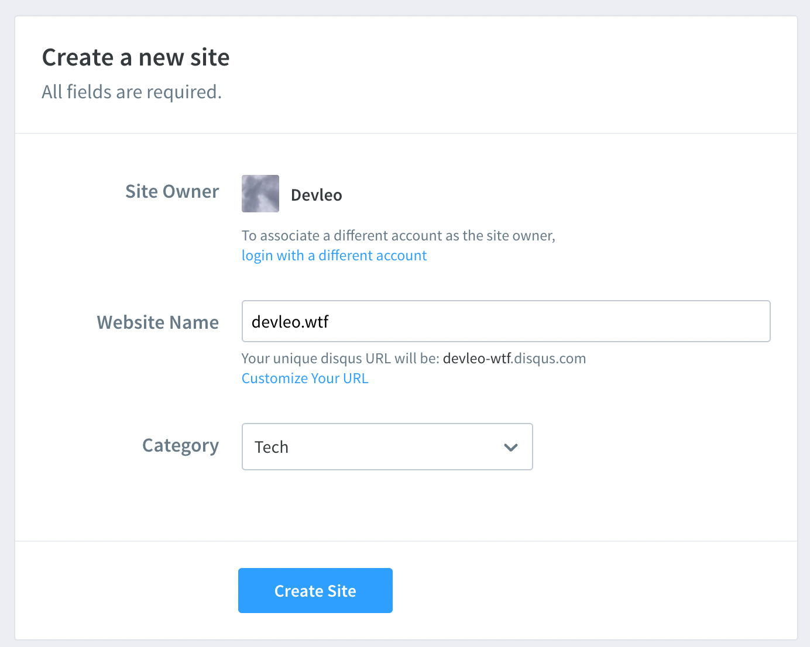
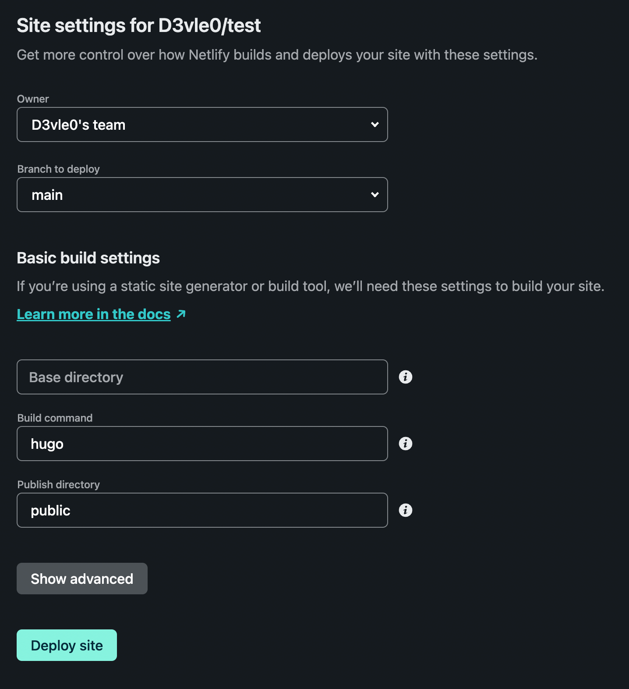

## 정적 사이트란?

정적 사이트 (Static Site) 란 로그인, 회원 가입, DB 등 사용자 정보에 따라 동적으로 작동하는 웹이 아닌 그 누가 접속하더라도 똑같은 결과를 보여주는 순수 HTML (+CSS, JS) 로만 이루어진, 말 그대로 정적인 상태를 유지하는 사이트를 뜻한다. 블로그에 글을 작성할 때 마다 일일히 HTML 파일을 작성할 수는 힘들기 때문에 정적 사이트 생성기 (Static Site Generator) 라는 프로그램들이 존재한다. 대표적으로 Jekyll, Gatsby, Hugo, Hexo 등이 있다.

### Jekyll

- Ruby 기반
- Github Pages에 내장되어 있어 github과 연동해서 사용하기 편함
- 테마, 플러그인, 관련 자료 풍부
- 페이지 수가 많아지면 기하급수적으로 빌드 속도가 느려짐

### Gatsby

- React 컴포넌트 사용할 수 있음
- GraphQL 사용 가능
- 공부해야 할 것이 많다

### Hugo

- Go 기반
- 빌드 속도가 매우 빠름

### Hexo

- node.js 기반

필자는 Hugo를 활용하여 자신만의 블로그를 구축하는 방법을 소개하겠다.

---

## 설치

```bash
brew install hugo
```

homebrew로 손쉽게 설치할 수 있다.

## 테마 선택

[이곳에서 본인이 원하는 블로그 테마를 선택할 수 있다.](https://themes.gohugo.io/) 필자는 `hugo-coder` 라는 테마를 사용중이다. <!--`hugo-coder` 테마를 기준으로 설명하겠지만 다른 테마 역시 동일한 방법으로 진행하면 된다.-->

## 새 블로그 생성과 테마 적용

```bash
hugo new site <블로그 이름>
cd <블로그 이름>
git init
git submodule add <테마 github 주소> themes/<테마 이름>
```

`themes/<테마 이름>` 디렉토에 들어가면 `exampleSite` 라는 디렉토리가 있는데, 그 안에 있는 `config.toml` 파일을 복사하여 최상위 경로의 `config.toml`에 덮어씌운다. 이 과정을 따로 커맨드로 정리하지 않은 이유는 테마마다 config 파일 확장자가 다를 수 있고, 심지어 config 파일의 경로가 다를 수 있기 때문이다. 결론적으로는 `exampleSite` 디렉토리 안의 폴더 구조와 최상위 경로의 구조를 같게 하면 된다.

## config 파일 수정

현재 기본 config 값은 이렇게 되어있다.

```toml
baseURL = "http://www.example.com"
title = "johndoe"
theme = "hugo-coder"
languageCode = "en"
defaultContentLanguage = "en"
paginate = 20
pygmentsStyle = "bw"
pygmentsCodeFences = true
pygmentsCodeFencesGuessSyntax = true
enableEmoji = true
# Enable Disqus comments
# disqusShortname = "yourdiscussshortname"

[params]
author = "John Doe"
# license = '<a rel="license" href="http://creativecommons.org/licenses/by-sa/4.0/">CC BY-SA-4.0</a>'
description = "John Doe's personal website"
keywords = "blog,developer,personal"
info = ["Full Stack DevOps", "Magician"]
avatarURL = "images/avatar.jpg"
#gravatar = "john.doe@example.com"
dateFormat = "January 2, 2006"
since = 2019
# Git Commit in Footer, uncomment the line below to enable it
commit = "https://github.com/luizdepra/hugo-coder/tree/"
# Right To Left, shift content direction for languagues such as Arabic
rtl = false
# Specify light/dark colorscheme
# Supported values:
# "auto" (use preference set by browser)
# "dark" (dark background, light foreground)
# "light" (light background, dark foreground) (default)
colorScheme = "auto"
# Hide the toggle button, along with the associated vertical divider
hideColorSchemeToggle = false
# Series see also post count
maxSeeAlsoItems = 5
# Custom CSS
customCSS = []
# Custom SCSS, file path is relative to Hugo's asset folder (default: {your project root}/assets)
customSCSS = []
# Custom JS
customJS = []

# If you want to use fathom(https://usefathom.com) for analytics, add this section
# [params.fathomAnalytics]
# siteID = "ABCDE"
# serverURL = "analytics.example.com" # Default value is cdn.usefathom.com, overwrite this if you are self-hosting

# If you want to use plausible(https://plausible.io) for analytics, add this section
# [params.plausibleAnalytics]
# domain = "example.com"
# serverURL = "analytics.example.com" # Default value is plausible.io, overwrite this if you are self-hosting or using a custom domain

# If you want to use goatcounter(https://goatcounter.com) for analytics, add this section
# [params.goatCounter]
# code = "code"

# If you want to use Cloudflare Web Analytics(https://cloudflare.com) for analytics, add this section
# [params.cloudflare]
# token = "token"

# If you want to use Matomo(https://matomo.org) for analytics, add this section
# [params.matomo]
# siteID = "ABCDE" # Default value is "1", overwrite this if you are cloud-hosting
# serverURL = "analytics.example.com" # For cloud-hosting, use provided URL, e.g. example.matomo.cloud

# If you want to use Google Tag Manager(https://analytics.google.com/) for analytics, add this section
# [params.googleTagManager]
# id = "gid"

# If you want to implement a Content-Security-Policy, add this section
[params.csp]
childsrc = ["'self'"]
fontsrc = ["'self'", "https://fonts.gstatic.com", "https://cdn.jsdelivr.net/"]
formaction = ["'self'"]
framesrc = ["'self'"]
imgsrc = ["'self'"]
objectsrc = ["'none'"]
stylesrc = [
  "'self'",
  "'unsafe-inline'",
  "https://fonts.googleapis.com/",
  "https://cdn.jsdelivr.net/"
]
scriptsrc = [
  "'self'", 
  "'unsafe-inline'", 
  "https://www.google-analytics.com",
  "https://cdn.jsdelivr.net/"
]
prefetchsrc = ["'self'"]
# connect-src directive – defines valid targets for to XMLHttpRequest (AJAX), WebSockets or EventSource
connectsrc = ["'self'", "https://www.google-analytics.com"]

[taxonomies]
category = "categories"
series = "series"
tag = "tags"
author = "authors"

[[params.social]]
name = "Github"
icon = "fa fa-2x fa-github"
weight = 1
url = "https://github.com/johndoe/"

[[params.social]]
name = "Gitlab"
icon = "fa fa-2x fa-gitlab"
weight = 2
url = "https://gitlab.com/johndoe/"

[[params.social]]
name = "Twitter"
icon = "fa fa-2x fa-twitter"
weight = 3
url = "https://twitter.com/johndoe/"

[[params.social]]
name = "LinkedIn"
icon = "fa fa-2x fa-linkedin"
weight = 4
url = "https://www.linkedin.com/in/johndoe/"

[[params.social]]
name = "Medium"
icon = "fa fa-2x fa-medium"
weight = 5
url = "https://medium.com/@johndoe"

[[params.social]]
name = "RSS"
icon = "fa fa-2x fa-rss"
weight = 6
url = "https://myhugosite.com/index.xml"
rel = "alternate"
type = "application/rss+xml"

[languages.en]
languageName = ":uk:"

[[languages.en.menu.main]]
name = "About"
weight = 1
url = "about/"

[[languages.en.menu.main]]
name = "Blog"
weight = 2
url = "posts/"

[[languages.en.menu.main]]
name = "Projects"
weight = 3
url = "projects/"

[[languages.en.menu.main]]
name = "Contact me"
weight = 5
url = "contact/"

[languages.pt-br]
languageName = ":brazil:"
title = "João Ninguém"

[languages.pt-br.params]
author = "João Ninguém"
info = "Full Stack DevOps e Mágico"
description = "Sítio pessoal de João Ninguém"
keywords = "blog,desenvolvedor,pessoal"

[[languages.pt-br.menu.main]]
name = "Sobre"
weight = 1
url = "about/"

[[languages.pt-br.menu.main]]
name = "Blog"
weight = 2
url = "posts/"

[[languages.pt-br.menu.main]]
name = "Projetos"
weight = 3
url = "projects/"

[[languages.pt-br.menu.main]]
name = "Contato"
weight = 5
url = "contact/"
```

여기서 사이트 주소, 제목, 작성자, 날짜 형식, 프로필 사진, 한 페이지 당 게시물 수 등을 설정할 수 있다. 이 테마는 다국어 (브라질어) 를 지원하는 것 같은데, 필자는 다국어 페이지를 사용할 일이 없어 브라질어 관련 설정은 모두 지워 아래와 같이 설정하였다.

```toml
baseURL = "https://devleo.wtf"
title = "Devleo"
theme = "hugo-coder"
languageCode = "en"
defaultContentLanguage = "en"
paginate = 20
pygmentsStyle = "bw"
pygmentsCodeFences = true
pygmentsCodeFencesGuessSyntax = true
enableEmoji = true
# Enable Disqus comments
# disqusShortname = "yourdiscussshortname"

[params]
author = "Devleo"
description = "Devleo's Idea Note"
keywords = "blog,developer,personal"
info = ["Backend Developer", "Daydreamer"]
avatarURL = "images/cloud.png"
dateFormat = "January 2, 2006"
since = 2022
rtl = false
colorScheme = "auto"
hideColorSchemeToggle = false
maxSeeAlsoItems = 5
customCSS = []
customSCSS = []
customJS = []

[params.csp]
childsrc = ["'self'"]
fontsrc = ["'self'", "https://fonts.gstatic.com", "https://cdn.jsdelivr.net/"]
formaction = ["'self'"]
framesrc = ["'self'"]
imgsrc = ["'self'"]
objectsrc = ["'none'"]
stylesrc = [
  "'self'",
  "'unsafe-inline'",
  "https://fonts.googleapis.com/",
  "https://cdn.jsdelivr.net/"
]
scriptsrc = [
  "'self'", 
  "'unsafe-inline'", 
  "https://www.google-analytics.com",
  "https://cdn.jsdelivr.net/"
]
prefetchsrc = ["'self'"]
connectsrc = ["'self'", "https://www.google-analytics.com"]

[taxonomies]
category = "categories"
series = "series"
tag = "tags"
author = "authors"

[[params.social]]
name = "Github"
icon = "fa fa-2x fa-github"
weight = 2
url = "https://github.com/d3vle0/"

[[params.social]]
name = "RSS"
icon = "fa fa-2x fa-rss"
weight = 6
url = "index.xml"
rel = "alternate"
type = "application/rss+xml"

[languages.en]
languageName = ":uk:"

[[languages.en.menu.main]]
name = "About"
weight = 1
url = "about/"

[[languages.en.menu.main]]
name = "Blog"
weight = 2
url = "posts/"

[[languages.en.menu.main]]
name = "Tags"
weight = 3
url = "tags/"
```

이렇게 config 파일을 수정했다면 사이트를 미리보기 해보자.

```bash
hugo server
```

`http://localhost:1313` 에서 미리볼 수 있다.

## 글 작성하기

```bash
hugo new posts/<글 제목>.md
```

여기서 입력한 <글 제목> 은 url 부분에 들어가게 되니 영어 소문자와 `-` 만을 사용하는 것을 권장한다. 그러면 `content/posts/<글 제목>.md` 파일이 생겨나는데, 실제로 표시될 글 제목과 날짜, 작성자, 태그를 지정할 수 있도록 템플릿이 생겨난다.

```md
+++ 
draft = true
date = 2022-05-18T00:09:27+09:00
title = ""
description = ""
slug = ""
authors = []
tags = []
categories = []
externalLink = ""
series = []
+++
```

`draft` 는 초안인지 아닌지 기록하는 것인데, 이는 빌드 시 웹사이트에서 실제로 해당 글을 표시할지 말지를 선택하는 것이다. `false`로 해야 표시가 된다.  
위의 템플릿 밑으로 markdown 문법으로 글을 작성해나가면 된다.

## disqus 적용하기

[disqus에 로그인](https://disqus.com/)을 하고 [이곳을 눌러 자신의 사이트에 들어갈 댓글창을 만든다.](https://disqus.com/admin/create/)



pricing 화면에서는 basic을 subscribe하면 된다. 왼쪽 바에서 `general` 을 누르면 `Shortname` 을 확인할 수 있는데, 이 shortname을 `config.toml`에서 주석처리 되어있는 `disqusShortname` 에 넣으면 된다. 꼭 `hugo-coder` 테마처럼 맨 윗부분에 있지는 않을 수도 있다. 자신이 선택한 테마의 config 파일을 잘 살펴보다가 disqus shortname을 입력하는 부분이 있으면 그곳에 복사해주자. 그리고 disqus 사이트에서 표시되었던 `Shortname` 밑에 `Website URL`에 자신의 블로그 도메인을 입력한다.

## 실제 배포

github repository를 만들고 블로그 폴더를 통째로 push 한다. 정적 사이트를 자동으로 배포해주는 서비스인 netlify를 활용해서 serverless 환경에서 블로그를 배포할 예정이다.

netlify에서 github login을 하고 Add new site > Import an existing project > github을 차례대로 누른 뒤 조금 전 push한 repo를 선택한다.



위와 같이 자동으로 hugo 프로젝트임을 감지한 것을 확인하고 deploy site를 누른다.


도메인이 netlify에서 랜덤으로 지정한 도메인이다. 이제 자신만의 도메인을 연결해보자.

## 도메인 설정

namecheap에서 자신만의 도메인을 구매해보자. ([이곳에서 블록체인 도메인에 대한 내용을 읽을 수 있다.](https://devleo.wtf/posts/hns-domain/))

사이트 설정 > Domain Management 에서 Add custom domain 버튼을 누른다.


자신의 도메인을 입력하고 verify. 몇 분 뒤 자신만의 도메인이 적용된 것을 확인할 수 있다.

## 소감

원래 hugo를 사용해오다가 내가 마음에 드는 테마들이 jekyll에 많아서 jekyll로 갈아탈까 고민을 했었지만 친구의 겨우 몇 페이지짜리 정적 사이트가 빌드 되는데 수 초를 기다려야 하는 (github에 push 하는 속도보다 더 오래걸린다) 광경을 보고 hugo를 사용하는 것이 편하다고 느꼈다. hugo는 빌드 속도가 ms 단위이기 때문이다.
