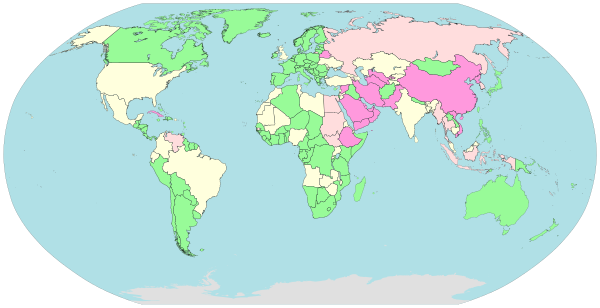
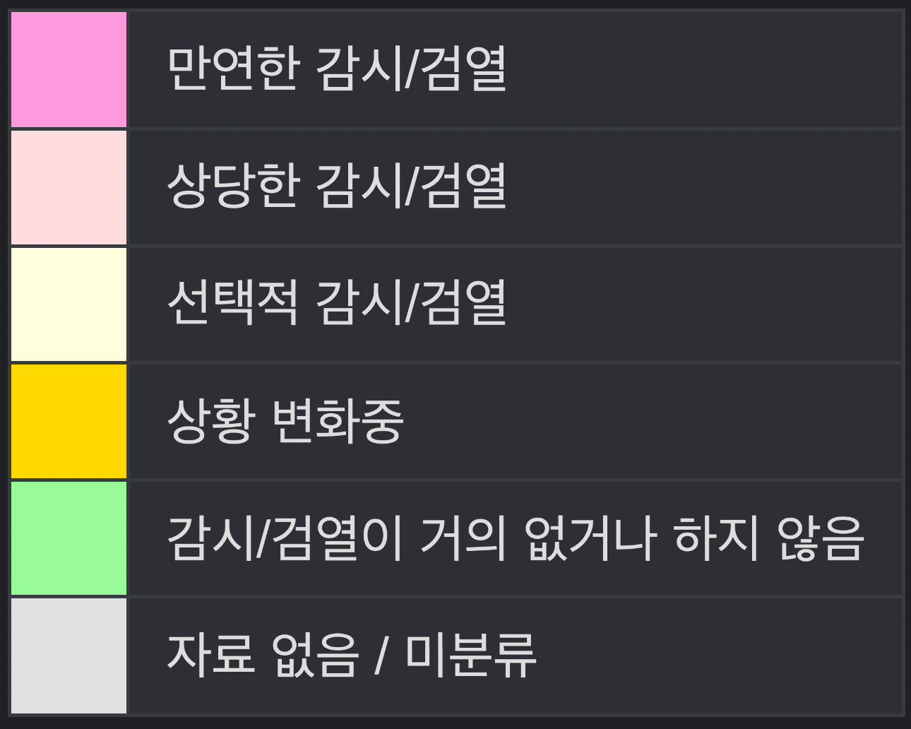
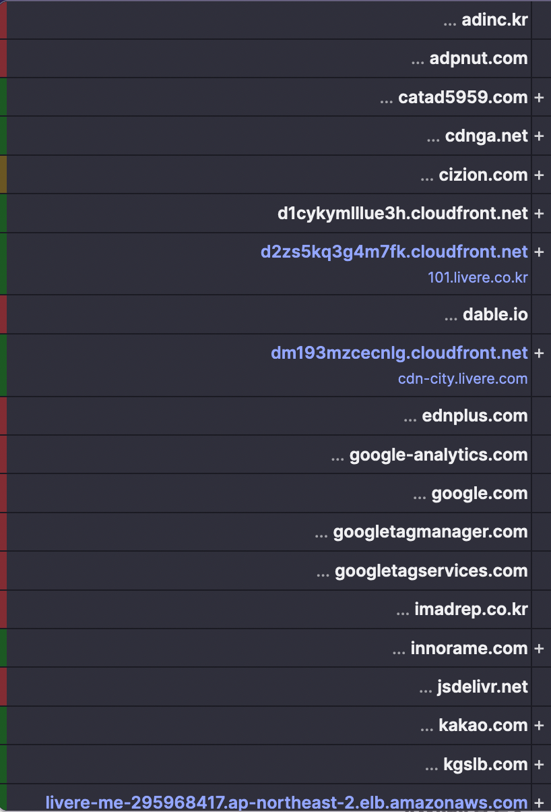
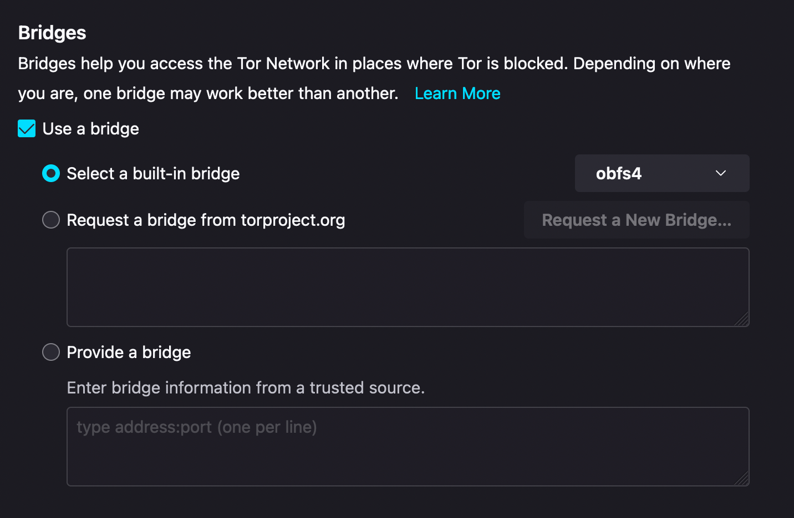
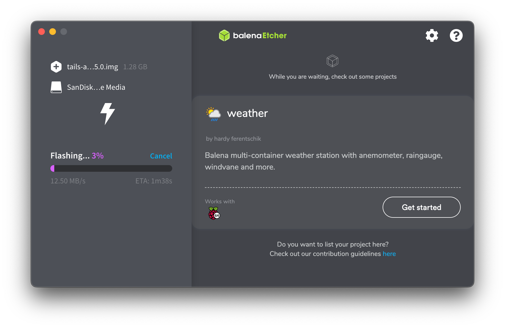

## 서문

국내 인터넷 검열 실태는 심각하다.

대부분의 국가들은 선택적 감시 (노란색), 감시가 거의 없음 (초록색) 상태인 반면 대한민국은 상당한 감시 (연분홍) 상태이다. ([출처](https://namu.wiki/w/%EC%9D%B8%ED%84%B0%EB%84%B7%20%EA%B2%80%EC%97%B4)) 셧다운제, SNI 차단, 인터넷 검열감시법만 봐도 그 실태를 알 수 있다. 만 16세 미만 아동청소년의 수면권 보장을 위해 시작된 셧다운제는 국내 게임회사에서 서비스하는 PC 온라인 게임에만 한정되어 있어 모바일 게임, 해외 플랫폼 게임에는 적용되지 않아 아무런 의미가 없었던 법안이다.  
2019년 SNI 차단은 https 패킷에서 SNI 필드에 접속하고자 하는 웹사이트 주소는 암호화되지 않는 원리를 이용했는데 **패킷을 감청**한다는 부분에서 국민들의 반발이 일어났고 이러한 방식은 위헌적이다.  
인터넷 검열감시법은 카카오톡 오픈채팅과 인터넷 커뮤니티에서 사진, gif, 압축 파일 등의 첨부파일을 올리면 해당 파일이 불법 촬영물인지 검열한다. 문제는 검열하는 AI 수준이 매우 떨어져 고양이 사진, 게임 일러스트 사진을 올려도 검열을 당하고 오픈 채팅 정지를 당하는 경우가 꽤 있다. 정작 텔레그램을 규제하지 않고 카카오톡과 인터넷 커뮤니티를 규제하는 것도 모순적이다.  
이 글에서는 국내 인터넷 검열을 피하고, 온라인에서 나의 흔적을 최대한 남기지 않는 방법을 설명하겠다.

## 메신저

일단 카카오톡은 거른다. 국내에서 서비스하는 메신저는 사용하지 말자. AI 챗봇 '이루다'를 보아라. 실제 연인들의 카카오톡 대화 데이터베이스를 그대로 사용하여 인공지능을 학습시켜 집 주소와 같은 개인정보가 유출되는 사례가 있었다. 물론 '연애의 과학' 앱 약관에서 데이터를 제 3자에게 제공할 수 있다는 항목이 있었지만 대부분의 사용자들은 그 부분을 주의 깊게 읽지 않았을 확률이 100%에 가깝고, 제공된다는 사실을 인지했어도 수 많은 사람들에게 노출될 것이라고는 상상도 못했을 것이다. 국내 메신저들은 이렇게 데이터 유출 위험, 적극적인 수사 협조에 대한 위험이 있으니 온라인에서 사람들과 소통이 불가피한 경우에는 텔레그램을 사용하자.  
카카오톡 PC 맥 버전은 아직까지도 m1 칩에 대응하지 못한 상태인 반면 텔레그램은 이미 오래전부터 m1 칩에 대응하여 개발했고, 프로그램이 가볍다. 특정 메세지에 답장할 때는 트랙패드를 스와이프 하면 된다. 직관적인데다가 스와이프 시 햅틱 반응까지 느껴진다. 그 뿐만 아니라 나만의 스티커 (이모티콘) 를 무료로 간편하게 만들 수 있어 대화의 재미도 높여준다. 단, 개인정보 보호를 위해 온라인 상태 표시를 끄는 것이 좋다.
모르는 사람들과 온라인에서 대화를 하고 싶을 때는 개인정보 관련 법률이 강력한 국가에서 운영하는 유료 VPN 서비스인 Nord VPN, Express VPN 등의 VPN 서비스를 이용한 상태로 익명의 IRC 서버에서 채팅한다.

## SNS

SNS를 사용하는 것은 매우 위험하다. 만약 SNS에 당신의 사진을 업로드 했다면 당장 삭제해야 한다. 온라인 상에 자신의 얼굴이 노출되어 있는 것만큼 위험한 것이 없다. SNS를 통해 당신의 전화번호, 이메일, 주소 등이 노출될 수 있고 SNS 사용이 불가피하다면 현실 세상과 구분되는 제 2의 자아로 사용한다. 가명, 실제 전화번호가 아닌 투넘버 서비스로 개통한 또 다른 전화번호, 오직 SNS 가입만을 위한 이메일을 활용하자.

## 트래커

트래커란 광고와 함께 딸려오는 개인정보 수집기를 뜻한다. 트래커는 개인정보를 수집하는 코드나 웹사이트를 포함한다. 개인정보라고 하면 IP주소, 쿠키 데이터, 심지어 심한 경우에는 브라우저 창 크기 (해상도) 수집, 스크롤 양상을 통해 마우스 유저인지 트랙패드 유저인지 구분하는 것까지 포함한다.

위 사진은 한 뉴스 사이트에 달린 트래커들이다. 이러한 트래커들은 빅데이터 수집 업체, 데이터 브로커들에게 넘어간다. 만약 쿠팡에서 블루투스 마우스에 대해 검색을 했다면 쿠팡 창을 닫아도 다른 인터넷 사이트에 쿠팡 광고가 뜨고, 내가 검색한 제품들의 사진이 나오게 된다. 이렇게 빅데이터를 기반으로 한 사용자 맞춤 광고가 트래커 기술 덕분에 가능한 것이다. 다만 나의 인터넷 사용 패턴이 남에게는 돈이 되고, 나의 신상은 물론 내가 좋아하는 것들까지 알려지게 되는 것이니 굉장히 불쾌하다.  
광고 및 트래커 차단 기능이 탑재되어 있는 firefox 브라우저를 사용하면 트래커들로부터 자유로울 수 있다. safari도 트래커 차단 기능이 있긴 하나 어딘가 모르게 불편하고 사용자 경험이 개발자 친화적이지 않다.

## 공용 PC

한 집에서 가족들이 같이 사용하는 컴퓨터를 사용하고 있고, 숨기고 싶은 자료가 있다면 가상 머신을 활용하는 것도 방법이다. Windows 환경에서 virtualbox 프로그램을 기준으로 설명해보자면, 가상 머신 파일을 `.vmdk` 파일 하나로 저장하게 하고, 자신만의 알고리즘을 이용해서 파일의 16진수 값을 변조시키고, 가상 머신 파일을 system32 폴더 깊숙히 어딘가에 넣어두자. 방법은 이하 생략한다.

## 검색 엔진

일단 구글은 거른다. 구글은 당신의 모든 것을 알고 있다. 구글 역시 구글 애널리틱스 트래커가 존재한다. 구글이야말로 정말로 개인정보를 모조리 수집해가는 기업이기 때문에 구글 대신 startpage 또는 duckduckgo를 추천한다. 익명성을 유지한 채로 검색할 수 있다.

## 이메일 서비스

앞서 구글 검색 엔진이 개인정보 측면에서 좋지 않다고 설명했는데, 사실 구글이라는 생태계 자체가 좋지 않다. 이메일은 gmail이나 네이버 등을 사용하지 말고 protonmail을 사용하자. 2022년 5월 protonmail 서비스가 proton 생태계를 구축했는데, 메일, 캘린더, 드라이브, VPN을 모두 익명성을 유지한 채로 사용할 수 있는 생태계다. 구글 생태계에서 벗어나고 싶다면 proton 생태계도 알아보는 것을 추천한다. protonmail은 개인정보 보호법이 강력한 국가에서 운영, 암호화된 이메일 통신을 이용하여 사생활을 보호한다.

## Tor Browser

[Tor에 관한 기본적인 개념은 이 글에서 언급했다.](/posts/setup-tor-relay) 간단하게 추가적인 설정을 짚고 넘어가자면, 수사 기관에서는 누군지는 모르지만 어떤 사용자가 Tor 브라우저를 사용했다는 기록을 패킷 분석을 통해 확인할 수 있다. 하지만 Tor 브라우저 설정을 조금만 바꿔주면 Tor 브라우저를 사용했다는 기록도 알아차리기 힘들게 만들 수 있다.

바로 bridge 기능을 사용하는 것인데, obfs4 bridge는 트래픽을 랜덤화하여 Tor 트래픽인 것을 감지하지 못하도록 한다. meek-azure bridge는 마이크로소프트 서버에 연결된 척 속이는 방식이다. bridge 네트워크 사용 유저는 하루에 국내 150명 정도 존재한다.

## Tails OS

이 글의 핵심 내용이다. Tails OS란 보안을 굉장히 중시해서 만든 debian 기반 리눅스 배포판이다. 기본 브라우저는 Tor, USB를 통한 live boot로 사용하는 방식이어서 모든 데이터는 RAM에만 저장이 되고 컴퓨터를 종료하면 모든 데이터가 사라진다. 게다가 자동으로 LUKS를 활용해 컴퓨터가 켜져있는 동안에는 모든 데이터가 암호화 되어있다. live boot 방식이기 때문에 급습에 대비하여 USB를 뽑는 순간 전원이 꺼진다. (실제로 권장되는 시스템 종료 방법)  
[이곳에서](https://tails.boum.org/install/index.en.html) 이미지를 다운받고 balenaEtcher 를 통해 usb에 굽는다. 이후 Tails OS를 사용할 노트북이나 PC에서 USB를 부팅 최우선순위로 잡아주면 사용할 수 있다.

