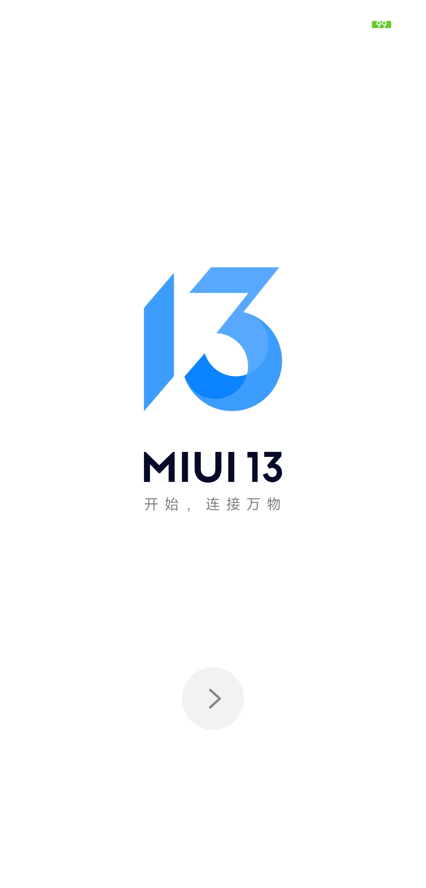

## 서론

약 3개월 간 Android 11 기반 Pixel Experience를 사용하다가 기본 탑재된 GCam이 너무 성능이 떨어지고 특히 동영상 촬영 시 초점이 안잡히는 문제가 있었다. 샤오미 기본 카메라의 편의성을 위해 다시 MIUI로 rollback 할 생각을 하던 중 Android 12 기반 MIUI 13을 port 시킨 롬을 찾았다. SPROM MIUI로 불리는 버전이고 중국 내수용 롬을 그대로 port 한 롬이라 한글 지원은 안된다.




모든 것이 작동되고 잘 좋았으나 Beta 버전인 만큼 무언가 어색한 UI, 그리고 개선되지 않은 GCam 탑재가 매우 불편하게 느껴져 **MIUI 12.6**을 찾았다.

## MIUI 12.6

Poco F1은 공식적으로 안드로이드 10 기반 MIUI 12까지 업데이트를 지원한다. 하지만 #oofgang에서 안드로이드 11 기반 12.6버전을 port 시켜 배포한 상태이다. 요즘 나오는 왠만한 커스텀 롬들이 모두 안드로이드 11 또는 12 기반이다 보니 11을 사용해도 전혀 문제가 없다. 기본적인 UX는 MIUI 12와 크게 다를 것이 없는데 UI는 상당히 개선이 되었고, 또 내가 UX가 떨어져 불편하다고 생각하는 안드로이드 12의 고질적인 Material You 디자인이 없다보니 사용성에 있어서는 상당히 매력적으로 다가왔다.

## 설치

oofgang에서 배포한 롬이기 때문에 oofgang 전용 twrp를 사용해야 한다.

```bash
./fastboot boot ~/Downloads/twrp-3.6.0_9-0-beryllium.img
```

먼저 순정 twrp로 부팅하고, 내장 메모리에 펌웨어와 oofgang twrp (V8) 을 넣은 뒤 flash 한다.

```bash
./adb push ~/Downloads/fw_beryllium_miui_POCOF1Global_V12.0.3.0.QEJMIXM_cf3fccffce_10.0.zip sdcard/Download
./adb push ~/Downloads/TWRP-V8-oofgang.zip sdcard/Download
```

이때 자동으로 oofgang twrp로 부팅이 되는데, 이 다음은 여느 커스텀롬 설치 과정과 똑같이 진행하면 된다.

1. Advanced Wipe
   + Dalvik / ART Cache
   + Cache
   + System
   + Vendor
   + Data
2. 펌웨어 플래시
3. 롬 플래시
4. ~~DisableForceEncryption~~ (이 롬에서는 필요 없다고 한다)

## 전화 문제

설치 후 문자는 되는데 전화가 안되길래 VoLTE 문제임을 알았고 `*#*#86583#*#*` 에 전화를 걸어 해결했다.
