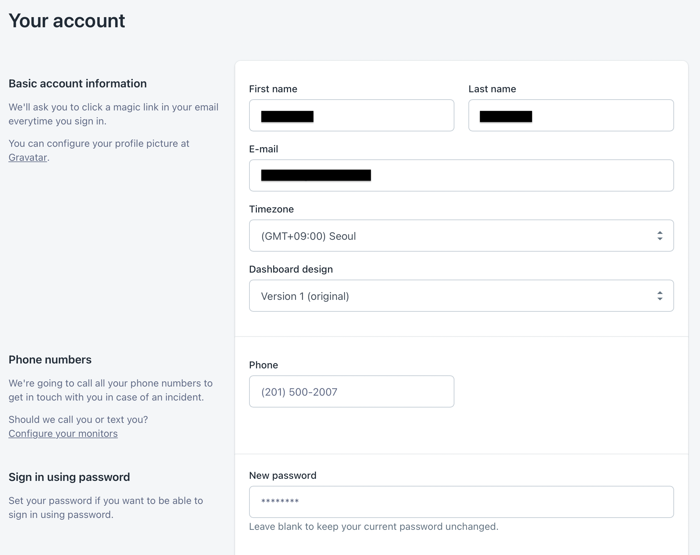
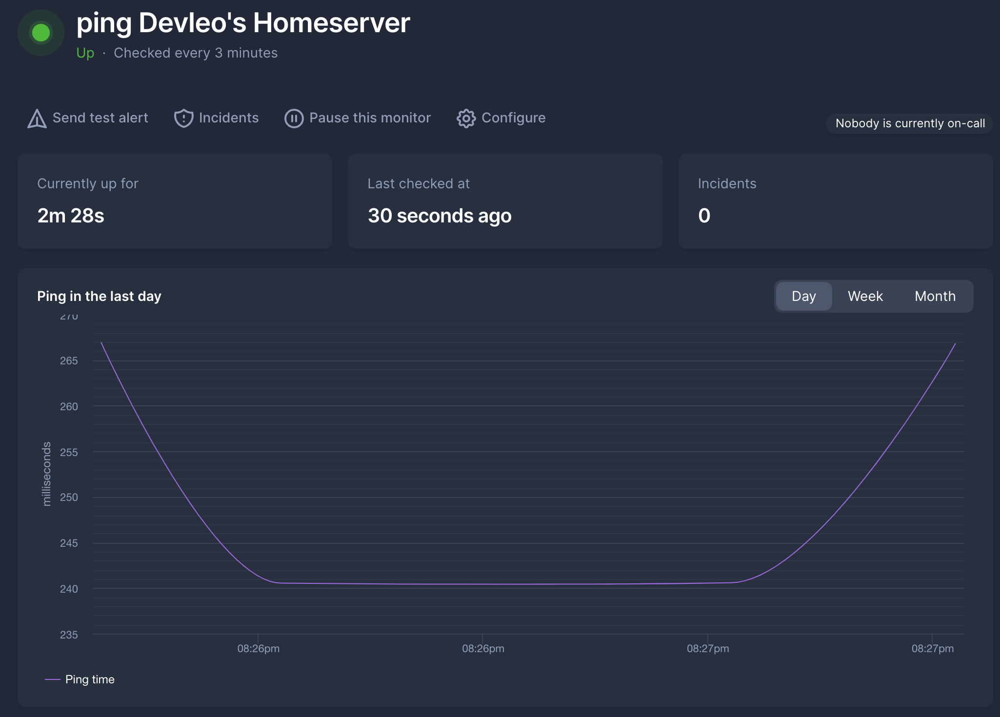
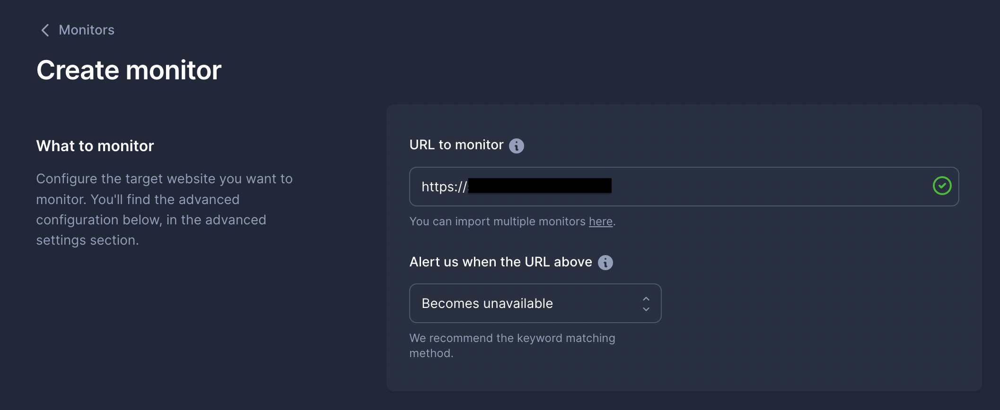
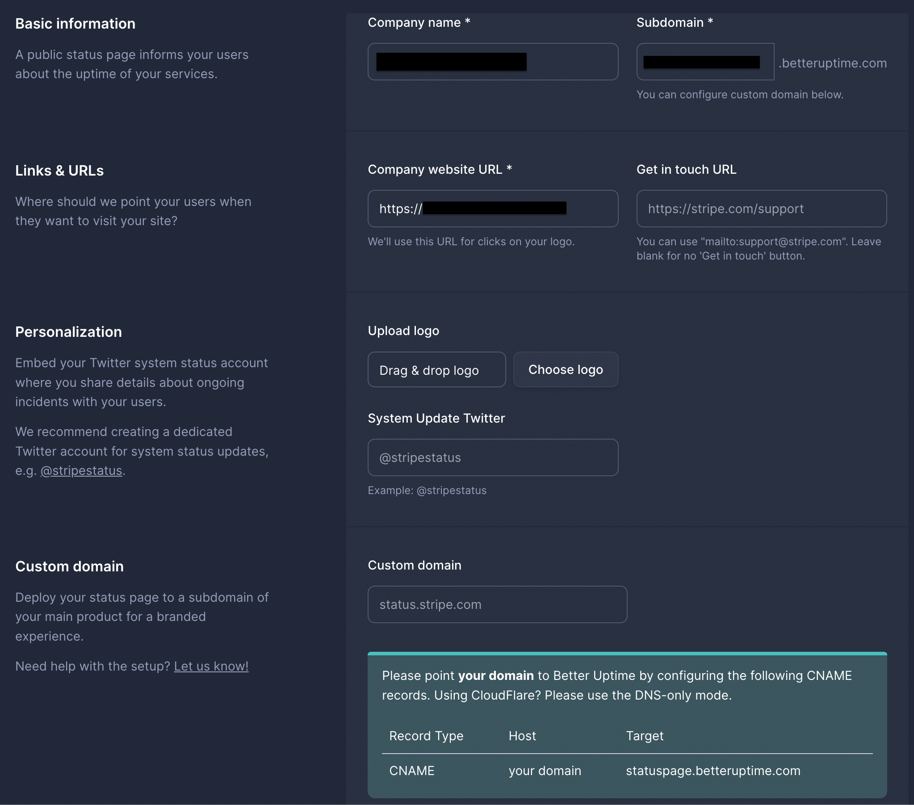
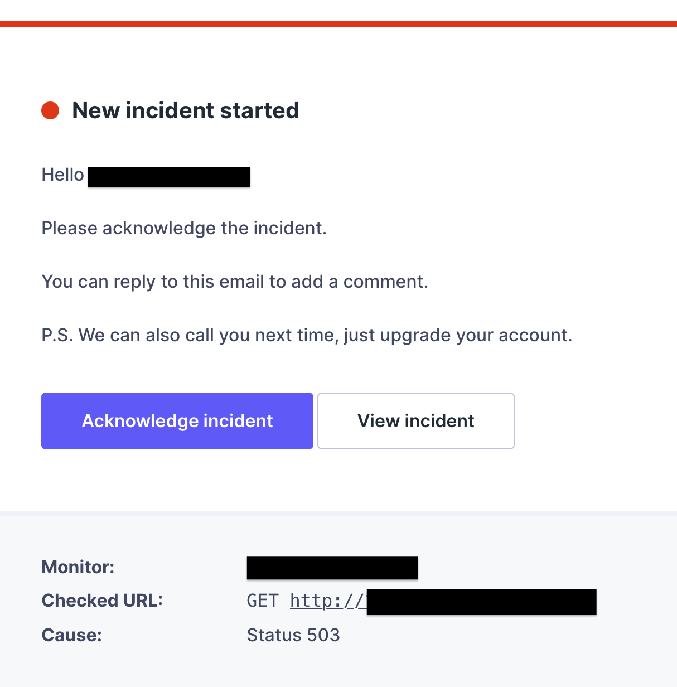

[BetterUptime이라는 서비스가 있다.](https://betteruptime.com) betteruptime이란 서버의 상태를 쉽게 모니터링할 수 있는 서비스인데, 웹사이트, SSL, ping, cron 등을 모니터링할 수 있다. 여기서 모니터링은 서버가 켜진지 꺼진지, uptime 시간과 비율은 얼마나 되는지에 대한 정보들을 확인하는 것을 말한다. BetterUptime 장점은 만약 서버에 문제가 생겼을 시 이메일, 전화, 문자, slack 등으로 즉시 알림을 보낼 수 있다.

## 가입

[BetterUptime 사이트에 들어가서](https://betteruptime.com) Sign Up을 한다.


처음 로그인할 때는 로그인 링크를 이메일로 받은 뒤, 계정 설정에서 비밀번호를 설정해주면 된다.


오른쪽 위 본인 이름을 누르고 `Your Account`를 누르면 새 비밀번호를 설정할 수 있다.



## ping 모니터링 설정

이제 본격적인 세팅을 해보자. 좌측 사이드바에서 Monitors > Create monitor을 누른다.


Host to monitor에 본인의 서버 url을 입력하고 Doesn't respond to ping으로 맞춘다. 여기서 url을 입력할 때는 `http://` 프로토콜을 뺀 나머지 부분을 입력해야 한다. 아래 사진에서는 프로토콜을 포함을 시켜서 host down 표시인 빨간색 X가 떠있다.


서버 별명을 설정, Recovery period는 서버가 고쳐졌다고 표시될때까지 기다리는 시간, ping timeout은 ping 응답 시간이 몇 초 이상이면 알림을 보낼지, confirmation period는 ping timeout이 얼마나 지속되면 알림을 보낼지 설정하는 것이다. 필자는 위와 같이 설정했고 아래의 create monitor를 눌러 시작하자.



30초마다 ping 체크를 하는 모습을 볼 수 있다. 해외 서비스라 그런지 집에 있는 홈서버는 ping이 200ms대로 조금 높게 나온다. (집으로부터 약 4km 떨어진 이곳에서는 10~20ms 정도 나온다.)

## 웹서버 모니터링 설정

내 홈서버 80, 443포트에 랜딩페이지 웹서버를 올려보겠다. certbot으로 https 인증서를 발급받고 nodejs로 웹서버를 열어보자.

```bash
sudo snap install certbot
sudo fuser -k 80/tcp
sudo certbot certonly --standalone -d <도메인>
```

이렇게 하면 https 인증서가 발급되고, 경로는 `/etc/letsencrypt/live/<도메인>/` 아래에 있다.

```bash
sudo npm i yarn -g
mkdir ~/landing
cd ~/landing
yarn init
nano landing.js
```

`landing.js` 파일은 아래와 같이 입력한다.

```js
const fs = require("fs");
const http = require("http");
const https = require("https");
const express = require("express");

const app = express();
const app2 = express();

const privateKey = fs.readFileSync("/etc/letsencrypt/live/<도메인>/privkey.pem", "utf8");
const certificate = fs.readFileSync("/etc/letsencrypt/live/<도메인>/cert.pem", "utf8");
const ca = fs.readFileSync("/etc/letsencrypt/live/<도메인>/chain.pem", "utf8");
const credentials = {
    key: privateKey,
    cert: certificate,
    ca: ca
};

const httpServer = http.createServer(app2);
const httpsServer = https.createServer(credentials, app);

app2.get("/", (req, res) => {
    res.redirect(301, `https://${req.hostname}${req.url}`)
})

app.get("/", (req, res) => {
    res.send("<h1>HTTPS Server running on port 443</h1>");
})

httpServer.listen(80, () => {
    console.log("http server running on port 80");
})

httpsServer.listen(443, () => {
    console.log("https server running on port 443");
})
```

```bash
sudo npm i pm2 -g
sudo pm2 start landing.js
```

서버 url 입력 후 `becomes unavailable` 선택하면 된다.



## Status 페이지 만들기

다른 사람들도 내 서버의 업타임 상태를 확인할 수 있는 페이지를 만들 수 있다. 왼쪽 사이드바에서 Status pages를 누른다.



도메인을 `<닉네임>.betteruptime.com` 으로 지정하여 해당 페이지에 현재 서버의 상태, 최근 incident는 어떠한지 표시한다. `CNAME` 레코드를 활용하여 커스텀 도메인까지 설정 가능하다.

## Incident Report

만약 서버가 꺼진다면 어떻게 될까? 홈서버의 uptime은 100%를 유지하기 위해 건들이지 말고, VPS에서 간단하게 nginx 웹서버를 열어보겠다. incident report 확인용이니 굳이 인증서는 적용하지 않겠다.

```bash
sudo apt-get install nginx
sudo fuser -k 80/tcp
sudo systemctl start nginx.service
```



80번 포트에서 웹서버가 제대로 열렸다. 위에 나온 방법대로 이 VPS 서버를 모니터링 해보자.

```bash
sudo service stop nginx
```

웹서버를 끄면 잠시 후 betteruptime에서 해당 모니터링 페이지에 빨간 불이 들어오고 메일이 온다.



<!-- ## 앱 설치

iOS, Android 전용 betteruptime 앱이 있다. m1 맥에서 [iOS 전용 앱을 설치하고](https://apps.apple.com/us/app/better-uptime/id1533057735) 모니터링 테스트를 해보겠다. -->
