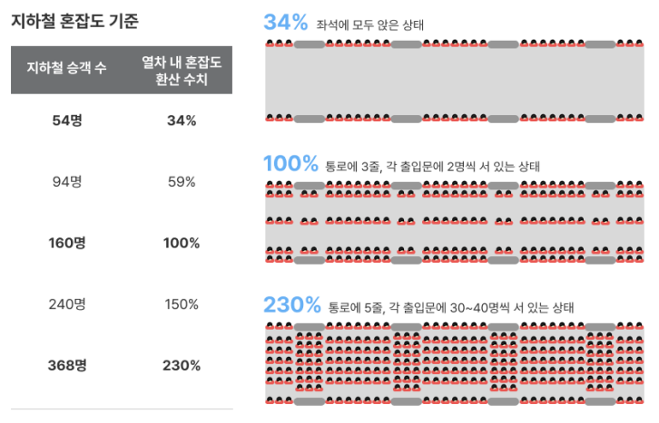
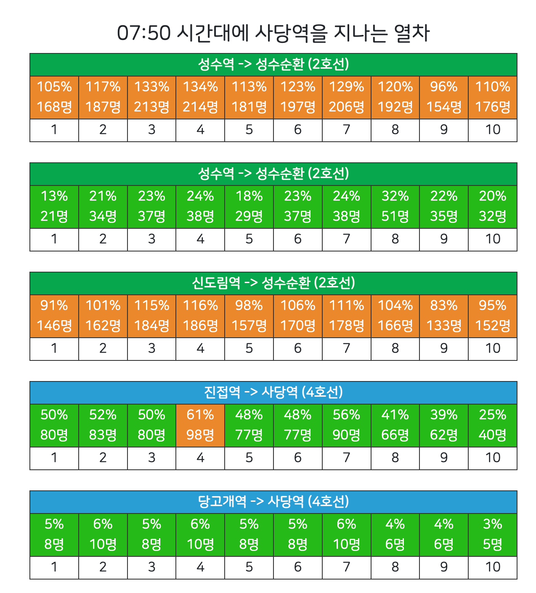
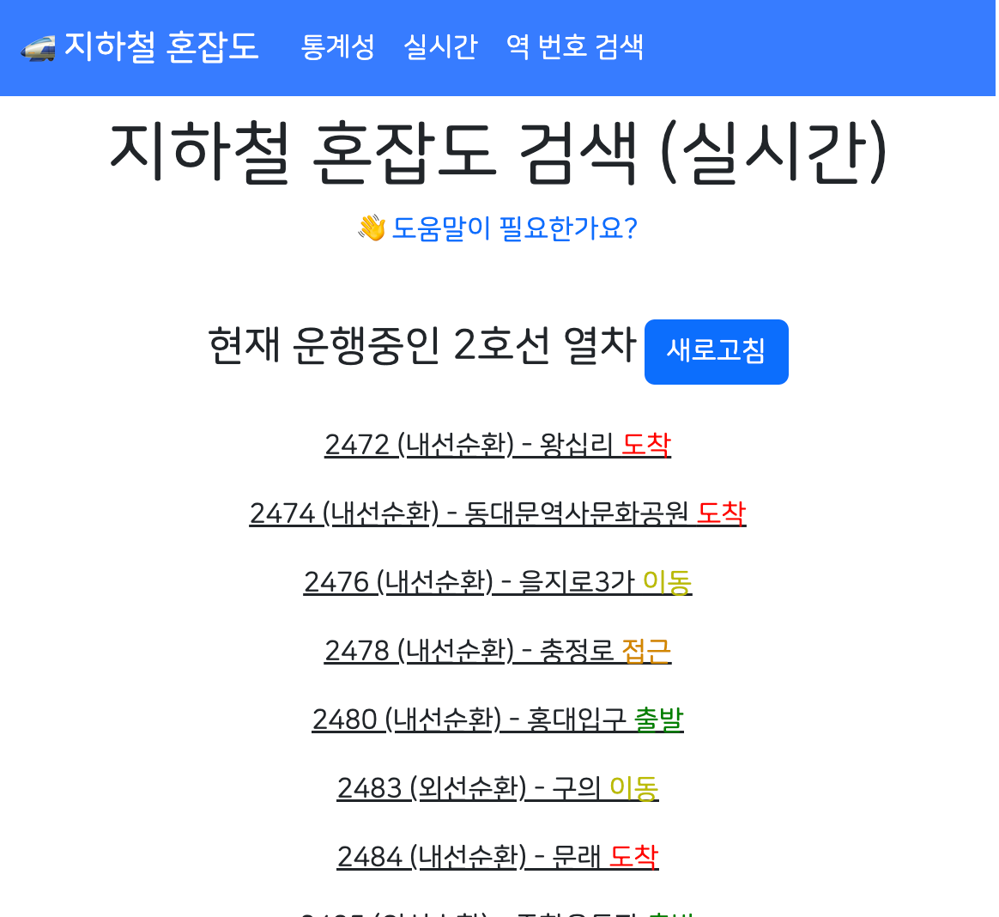
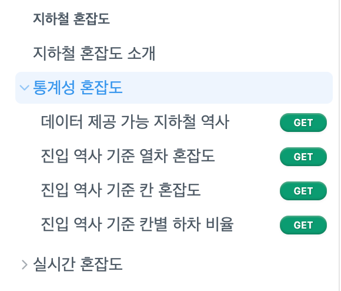

# 서론

[SK open API](https://openapi.sk.com/API/detail?svcSeq=54)

SK에서 운영하는 Open API 중에 지하철 혼잡도 데이터를 제공하는 API가 있다는 것을 [@D0hwq1](https://github.com/d0hwq1) 친구를 통해 알게 되었다. 오랜만에 API 활용 개발을 해볼 겸 지하철 혼잡도를 알려주는 사이트를 개발했다.

# API 소개

데이터 제공 가능한 역의 역 번호, 열차 혼잡도, 칸별 혼잡도, 칸별 하차비율, 실시간 혼잡도 이렇게 5개의 API가 제공되고 있다. 혼잡도 데이터는 **수도권 지하철 1호선~9호선과 신분당선**을 지원하고, 실시간 혼잡도는 2호선만 지원하며, 2호선을 타면 스크린에서 볼 수 있는 혼잡도 데이터를 불러오는 것이다. 100% 혼잡도는 열차 한 량에 160명이 있는 상태를 의미한다. 혼잡도에 대한 내용은 아래 사진을 참고하고, API 사용법은 공식 문서를 참고하자.

[실시간 열차/칸 혼잡도](https://skopenapi.readme.io/reference/%EC%8B%A4%EC%8B%9C%EA%B0%84-%EC%97%B4%EC%B0%A8%EC%B9%B8-%ED%98%BC%EC%9E%A1%EB%8F%84)

# 개발 과정

언어는 Python, 웹서버는 Flask로 구축하였다.

먼저 메인 화면은 간단하게 역명과 시간대, 요일을 입력할 수 있도록 했다. 시간대는 6시부터 23시 50분까지 10분 간격으로 선택 가능하며 자동으로 현재 시간대를 감지해서 검색하게 할 수도 있다. 실제 API에 호출할 때는 역 번호를 넣어주어야 하는데, SK에서 제공하는 API 중에 역명에 대응하는 역 번호를 표시해주는 API가 있으니 그것을 활용했다. 다만 주의할 점은 환승역은 각각의 노선마다 다른 역 번호를 가지는 것이다. 예컨대 종로3가역 1호선은 130, 3호선은 329, 5호선은 534를 가진다. 따라서 환승역의 경우 모든 역 번호를 추출하여 혼잡도를 검색하는 기능이 필요하다.

API 리턴값은 선택한 시간대에 해당 역을 지나는 열차에 대한 칸별 혼잡도 뿐 아니라 발차역, 종착역 데이터도 포함하는데, 이 데이터도 검색 결과에 넣어주었다.

실시간 혼잡도 데이터는 개발하기 조금 까다로웠는데, API에 열차 번호를 넣어줘야 한다는 점이다. 현재 운행 중인 열차 번호를 어떻게 알아내야 하는지가 관건이었다. 

[서울교통공사 실시간 열차 운행 정보](https://smapp.seoulmetro.co.kr:58443/traininfo/traininfoUserView.do)

서울교통공사에서 실시간으로 운행하는 열차번호와 위치를 제공하고 있는데, 이 사이트에서 내부적으로 호출하는 API post 요청을 잡아서 추출하였다.

덕분에 열차 번호와 위치, 상태(출발, 이동, 접근, 도착)와 혼잡도까지 구할 수 있었다.

# 결과

[지하철](https://subway-congestion.herokuapp.com/)

heroku를 통해서 자동으로 deploy 시켰다.