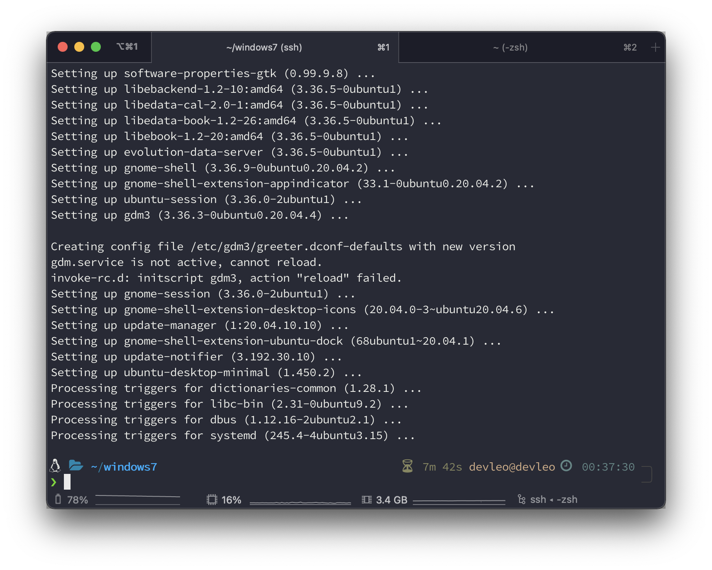

## 사용 환경

- Ubuntu Server 20.04.3 LTS
- macOS Monterey 12.1

## GUI의 필요성

홈서버에 windows vm을 설치할 일이 생겨 qemu로 설치를 하고, `ssh -X` 옵션과 xquartz를 통해 맥에서 해당 vm을 띄우는 세팅을 했는데, 안정성이 매우 떨어져 결국 ubuntu server에 gnome gui를 올리고 rdp로 접속하여 vmware를 통해 windows vm을 세팅하는 방향을 선택했다.  

서버에 gui가 돌아간다는게 참 불편하긴 하지만 때로는 cli보다는 gui 환경에서 세팅해야 편한 작업들이 꽤 있기 때문에 이번 기회에 설치를 해보고, 이 글에서는 아래의 순서대로 글을 작성하겠다.

1. `ubuntu-desktop`minimal 설치
2. `runlevel`설정
3. mac에서 rdp를 사용하여 접속

## ubuntu-desktop 설치

최대한 가벼운 시스템 구성을 위해 미니멀한 설치 옵션을 주겠다.

```bash
sudo apt install ubuntu-desktop-minimal
```

또는 폴더 아이콘이나 light/dark 모드 설정에 문제가 생겨도 상관이 없다고 생각한다면 더 미니멀하게 설치할 수도 있다.

```bash
sudo apt install --no-install-recommends ubuntu-desktop-minimal
```



설치가 완료되면 gui를 실행한다. 단 이 명령은 홈서버 노트북에서 입력해야 한다.

```bash
startx
```


잠시 기다리면 소프트웨어 업데이터가 나오는데 restart now를 누른다.


이제 정상적으로 ubuntu desktop이 설치가 되었다.

## runlevel 설정

부팅 시 xwindow (gui) 가 자동으로 실행되지 않게 하려면

```bash
sudo systemctl set-default multi-user
```

다시 xwindow가 자동으로 실행되게 하려면

```bash
sudo systemctl set-default graphical
```

어차피 vmware를 통해서 windows vm을 돌리는게 최종 목표이니 그냥 나는 gui를 자동 실행되게 하겠다. gui가 필요할 때 집 밖에 있으면 홈서버 노트북에서 startx 명령을 입력할 수 없기 때문이다.

## mac에서 rdp를 사용하여 접속

```bash
sudo apt-get install xrdp
```

`/etc/polkit-1/localauthority/50-local.d/45-allow-colord.pkla` 에 아래와 같은 내용을 입력한다.

```pkla
[Allow Colord all Users]
Identity=unix-user:*
Action=org.freedesktop.color-manager.create-device;org.freedesktop.color-manager.create-profile;org.freedesktop.color-manager.delete-device;org.freedesktop.color-manager.delete-profile;org.freedesktop.color-manager.modify-device;org.freedesktop.color-manager.modify-profile
ResultAny=no
ResultInactive=no
ResultActive=yes
```

`/etc/xrdp/xrdp.ini` 에서 포트를 원하는 값으로 변경할 수도 있다.


그 후 windows remote desktop 앱에서 호스트를 입력하고 username, password를 입력해주면 접속이 된다.
