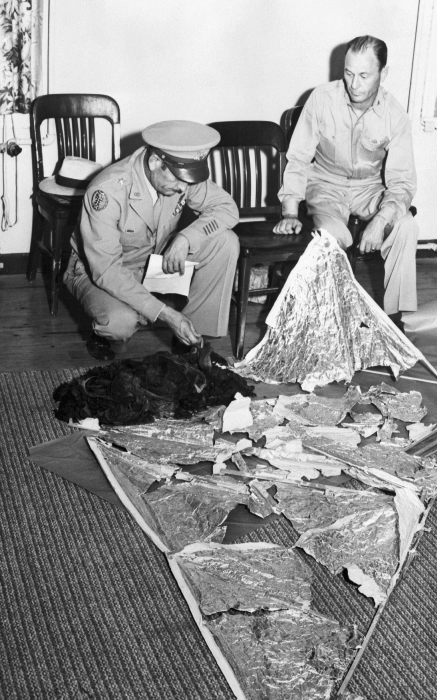

## 서문

과학적으로 증명되지 않은 미스테리 음모론입니다. (어쩌면 인간의 과학으로는 설명이 되지 않는 내용일 것입니다) 내용이 다소 충격적일 수 있으니 유의하여 읽기 바랍니다. 종교적인 이야기를 최대한 배제하고 팩트와 저의 생각만을 전합니다.

## 사건의 발단

모든 이야기는 **로스웰 UFO 추락사건**으로부터 시작된다. 1947년 7월 2일, 미국 뉴멕시코주 남동부의 로스웰 인근 지역에서 벌어진 UFO 추락사건이다. 정확히는 '코로나' 라는 마을 근처에서 벌어졌고, 로스웰에서 온 공군이 먼저 수사했기 때문에 로스웰 UFO 추락사건이라고 불린다.  
케네스 아놀드는 1947년 7월 워싱턴 주 케이케이드 산 3000m 상공에 시속 2560km로 날아가는 9개의 번쩍이는 비행 물체를 목격한다. 이후 윌리엄 브래즐이 로스웰 인근에서 UFO의 잔해를 발견, 7월 7일 미 육군 항공대가 해당 사실을 알고 비행 접시를 포획했다고 언론에 알렸다. 그러나 7월 9일, 신문사는 윌리엄 브래즐이 발견한 것은 은박지, 종이, 테이프와 막대였다며 발표 내용을 정정했다. 윌리엄 브래즐이 UFO의 잔해를 최초 발견했을 당시 지구 상에 존재하지 않는 물질이라고 주장하고 다녔는데 당시 폴리에틸렌 은박지가 널리 보급되지 않았던 시점이라 그에게는 신기한 물건이었을 것이라는 의혹이 있으나 이 글에서는 해당 잔해가 어떤 물질인지에 대한 이야기는 다루지 않겠다.  

이 사건이 일어났을 때 UFO 잔해를 보았던 다른 주민들의 증언에 따르면 처참히 부서진 잔해 안에는 **도저히 인간이라고 보이지 않는** - 키는 150cm, 손발가락은 6개인 외계인의 사체가 있었다. 만약 외계 생명체가 존재한다면 그것은 문어와 비슷한 모양일 것이라고 상상한 당시 사람들과는 달리 손발이 달려있고, 키가 작고 머리가 큰 '그레이 외계인' 모습을 한 사체가 발견되었다. 이 사건을 기점으로 우리는 '외계인' 하면 '그레이 외계인'을 떠올리게 된 것이다. **그런데 충격적이게도 한 마리의 외계인이 생존해 있었다.** 미 공군은 인류 역사상 최초로 살아있는 외계인을 생포하였고, 외계인을 로스웰 공군 기지로 이송했다가 이후 CIA의 비밀 은신처로 이동되었다.

추락으로 인해 외계인은 신체적으로 쇠약했고 외상으로 인한 물질적 충격으로 인해 이송되는 과정에서 그 어떤 소통이나 저항도 하지 않았으며 식음을 전폐하였다. CIA 요원 모두가 취조를 위해 소통을 시도했지만 응하지 않았고, 유대감 형성도 불가능했다. 그러나 유일하게 외계인에게 진심으로 다가갔던 인물이 있었으니, 바로 미공군 509사단 소속 간호장교 **마틸다 맥클로이** 상사였다.

## 외계인과 대화를 하다

그녀는 외계인에게 **'에어럴'** 이라는 이름을 붙여주었고 에어럴에게 진심으로 다가간 결과 조금씩 마틸다에게 마음을 열었다. **놀랍게도 에어럴은 말을 하지 않고 텔레파시로 소통을 했다.** 처음에는 이미지, 감정, 느낌을 마틸다에게 보내기 시작했고 마틸다도 텔레파시를 받고 해석하는지 점차 이해할 수 있게 되었다.

> 마틸다: 당신은 부상당했습니까?  
에어럴: 아니다  
마틸다: 음식이나 물 등 필요한 것이 있나요?  
에어럴: 필요없다  
마틸다: 당신의 정부 그리고 상사는 당신이 여기에 있는 것을 알고 있습니까?  
에어럴: 현재로서는 아니다  
마틸다: 당신의 종족이 보유한 무기의 파괴력은 어느 정도입니까?  
에어럴: 매우 파괴적  
마틸다: 당신의 우주선은 왜 추락했습니까?  
에어럴: 대기에서 발생한 번개로 인해 잠시 비행통제 능력을 상실했다  
마틸다: 왜 그 지역을 비행하고 있었습니까?  
에어럴: 불타는 구름, 방사능, 폭발을 조사하러 왔다  
>

매우 충격적이다. 아래 사진은 실제 생포된 에어럴과 마틸다의 모습이다.

마틸다는 에어럴에게 고전, 동화책, 역사책, 과학책 등 수많은 책을 갖다주었고 그 과정에서 에어럴은 영어를 습득하게 되었다. 신기한 점은 에어럴은 허클베리 핀, 걸리버 여행기, 피터팬과 같은 고전문학들에 매우 큰 흥미를 가지며
좋아하는 것처럼 보였다고 한다. 이제 에어럴은 영어로 된 메세지로 마틸다에게 텔레파시를 보냈다.

> 에어럴: 이제 말할 준비가 되었다.

## 도메인과 구제국

에어럴은 **도메인 원정대**의 일원으로 지난 수 천년 동안 은하계 이 구역을 담당하고 있다고 한다. **지구는 도메인 소유의 행성**이며, B.C. 5965년 이후로 지구인들과 접촉한 적이 없다. 에어럴은 지구인들과 접촉을 하는 것이 임무가 아니며, 군인, 조종사이자 엔지니어라고 한다. 에어럴은 343개의 외계 행성 언어를 구사할 수 있고, 마지막으로 배운 지구의 언어는 산스크리트어다.  

그럼 B.C. 5965년에 어떤 일이 있었던 것일까? 당시 지구 히말라야 산맥에 도메인의 기지가 있었는데, 알 수 없는 이유로 히말라야 산맥에 있던 도메인인들이 모두 실종되어 그들을 찾기 위해 지구에 왔었다. 에어럴은 실종된 팀원들을 찾던 도중 **도메인의 적대 세력인 구제국 세력**이 아직 존재한다는 것을 알게 되었다.  

우리 은하계는 2개의 외계 세력들에 의해 지배를 받아왔다. 한 세력은 도메인, 다른 한 세력은 구제국 세력인데 이들은 도메인이 생기기 오래 전부터 은하계를 지배해 왔다. 수십만년 전부터 은하계의 패권을 장악하기 위해 도메인과 구제국은 전쟁을 벌여왔는데 도메인의 기술이 순식간에 발전을 이룬 탓에 도메인은 구제국 본부가 있는 행성을 파괴하였고, 구제국은 힘을 잃게 된다. **이렇게 태양계의 지배권 역시 도메인 세력으로 넘어오게 되었다.**  

그러나 구제국이 완전 멸망한 것은 아니었다. 전쟁에서 도메인에게 수많은 패배를 당했지만 구제국은 **그들의 핵심 중앙 본부를 한 행성의 지하 기지에 숨겨놓고 있고 자국의 명맥을 계속 이어오고 있다.** 현재는 사실상 도메인이 은하계의 새 주인이 된 것은 맞지만 구제국도 도메인 몰래 우리 은하계의 몇몇 행성들을 자신들의 지배하에 두고 통제를 해오고 있다. **그리고 지구 또한 과거 구제국 세력의 지배하에 있던 행성이었다.**

## 생명의 본질

> 에어럴: 모든 생명체는 영원불멸의 존재이다. 그것은 인간도 마찬가지이며 영원불멸의 영적 존재들은 그냥 존재하는 것이고, 존재하는 이유는 이들이 존재하기로 선택했기 때문이다. 당신들의 사회에서 높은 위치에 있는 사람들, 낮은 위치에 있는 사람들을 포함해 모두가 영원불멸의 영혼을 가진 존재이다, 인간도 이 사실을 깨달아야 될 시기가 왔다.
>

마틸다는 영원불멸의 개념에 대해 이해하지 못했다. 그녀는 지금까지 살면서 인간을 영원불멸의 존재라고 생각해 본 적이 없기 때문이다. 그러자 에어럴은 간단을 시범을 선보이고 싶다며 아래와 같이 말했다.

> 에어럴: 너의 몸을 떠나라.
>

그 순간 마틸다는 본인의 의식이 육체를 떠나는 것을 느꼈고 하늘에 붕 떠있는 상태로 3인칭 시점에서 자신의 육체를 관찰했다. **유체이탈을 경험한 것이다.**

### 이원론

에어럴은 마틸다에게 직접 이원론이 사실이라는 것을 증명했다. 이원론은 인간의 정신과 육체는 분리되어 존재하는 것을 말한다. 정확히는 정신과 육체라는 실체가 따로 있다는 견해인 '실체 이원론', 그리고 실체는 물리적 실체 하나 밖에 없지만 '물적 속성'과 '심적 속성'은 따로 있다는 '속성 이원론'으로 나뉜다. 실체 이원론의 대표적인 옹호자는 르네 데카르트가 있다. ([2022학년도 대수능 예시문제 국어영역 5~10번 문제 지문에 이원론과 동일론에 관한 내용이 나온다.](https://www.suneung.re.kr/boardCnts/view.do?boardID=1500236&boardSeq=5050078&lev=0&m=0403&searchType=S&statusYN=W&page=1&s=suneung))  
즉 에어럴은 인간의 육체는 세월이 지나며 늙고 병들고 썩어 없어지는 유한한 존재지만 우리가 생각하고, 느끼고, 사고하는 정신과 의식, 즉 영혼은 무한한 시간의 흐름에도 죽지 않고 존재한다는 것임을 보였다.

## 인간의 죽음 이후

도메인은 빛의 세력이며 선한 존재임에 반해 구제국은 어둠의 세력이며 악의 화신이다. 구제국이 은하계를 통치했을 시절, 극악무도한 범죄자들, 자유로운 생각을 지닌 자들, 구제국에 대항하는 혁명가들, 정치 범법자를 체포해서 기억을 지운 뒤 지구에 감금을 해두었다. 이 안에는 도메인과의 전쟁 중에 붙잡아 전쟁 포로가 된 도메인 종족의 영혼들 또한 포함되어 있다. 구제국은 지구에 감금된 이들을 '손댈 수 없는 천민' 계급으로 분류시켰고, 그 안에는 예술가, 화가, 가수, 음악가 등 각종 예술 문화인이 있다. **이것이 다른 어떤 구제국 행성보다도 수많은 예술가들이 지구에 존재하는 이유다.**  

구제국은 은하계 구역 전체에 **강력한 전자 스크린망**을 설치했다. 인간이 죽고 나서 영혼이 지구를 빠져나가 전자 스크린망에 닿게 되면 매우 강력한 전기 세뇌과정을 거쳐 영혼은 육제에서 살아온 생의 기억들을 완전히 잃고 무한의 시간동안 살아왔던 영혼으로서의 기억도 사라지게 된다. 이것은 마치 지구의 심리학자들이 환자들을 보다 협조적이고 부드럽게 만들기 위해 강력한 전기쇼크 치료 방법을 사용하여 그들의 기억과 본질 성향을 지우는 것과도 비슷하다. 그 후 '집으로 돌아간다' 명령어를 주입한 후 영혼은 다시 지구의 땅으로 돌아가 또 다른 육체를 얻어 환생한다. **정리하자면 우리 인간은 구제국에서의 범죄자였고 그 벌로 지구라는 거대한 감옥 속 육신에 갇혀 영원히 감옥 생활을 하고 있는 것이다.** 무한히 긴 시간동안 말이다.  

도메인은 선학 세력인데 인간이 아직까지 구제국의 시스템에 갇혀 있는 이유는 지구는 통제 불능의 정신병적인 존재들이 사는 감옥 행성이며 본질적으로 상당히 불안정하고, 도메인이 지구에 착륙하기까지는 많은 자원과 위험이 따른다. 무엇보다 도메인은 아직도 구제국의 시설들을 다 찾지 못했고, 특히 핵심 중앙본부를 찾지 못해 우리 은하를 덮을 정도로 방대한 전자 스크린망의 동력원을 파괴할 수 없었다.

## 전자 스크린망의 허점

**모든 시스템은 아무리 견고하더라도 허점이 발견되거나 생기기 마련인데 전자 스크린망과 지구 감옥을 탈출한 영혼이 있지 않을까?** 이에 대해 마틸다가 물었다. 그러자 에어럴은 충격적인 이야기를 꺼냈다. **지구 감옥을 탈출한 인물들 중 한 명은 고타마 싯다르타, 즉 우리가 아는 부처고 또 한 명은 중국의 노자라고 한다.** 노자는 중국 역사상 우주 만물에 대해 생각해낸 최초의 인물인데, 그는 생을 마감하기 전 한 작은 마을에서 세월을 보냈다. 그때 그는 삶의 본질을 깊이 숙고하였고 자신의 전생에 대해 직시하게 되었다. 그러자 인간의 기억이 아닌 영혼으로서의 기억과 불멸성을 일부 되찾았고, 산으로 들어가 인간의 육체를 떠나기로 결심한다. 노자가 산으로 가기 전 마을의 문지기가 그에게 가르침을 달라고 하였는데, 그 내용은 이러하다.

---

보는 자는 보지 못할 것이며  
듣는 자는 듣지 못할 것이며  
찾는 자는 붙잡지 못할 것이다  
영의 무한한 본질이 생명의 근원이다  
영은 영 스스로이다  
영은 영 그 자체이다  
벽이 생기고 방을 만든다  
항아리는 진흙으로 만든다  
그럼에도 그 속에 생긴 공간이 가장 중요하다  
무엇도 아닌 영 그대로가 모든 형상의 근원이다  

---

이것을 에어럴의 말대로 해석해보면, 세상을 보고, 듣고, 판단하기 때문에 보고는 있지만 진짜 '현실'을 보지는 못하는 것이고, 듣고는 있지만 진실을 듣지는 못한다. '벽'은 구제국이 설치한 '전자 스크린망'을 일컫는 게 되고 '방'은 영혼들이 갇혀 있는 '지구'를 뜻하며 진흙으로 만들어진 '항아리'는 '인간의 육체'를 의미하는 것이라고 한다.

## 지구 감옥 탈출 방법?

에어럴은 이렇게 말했다.

> 인류가 살아남기 위해서는 현재 당신들의 존재가 처해있는 상황을 극복할 수 있는 효과적인 방법을 찾기위해 서로가 협력해야 한다. 또한 인류는 한낱 생물학적 몸뚱이에 불과하다는 개념을 초월하기 위해 진정 영혼으로서 자신들이 누구인지를 깨달아야 하며, 너희가 갇혀있는 인간의 형체를 넘어서야 극복할 수 있다. 그렇지 않는다면 지구 감옥에서의 영혼들은 미래가 없다.
>

진정 영혼으로서 내가 누구인지 깨달아야 한다고 한다. 이 이야기가 사실이라면 물리적으로 지구 감옥을 탈출할 방법은 없어보인다.

## 창조주

마틸다는 에어럴이 가진 육신에 대해 의문점이 생겼다. 에어럴은 생리학적이든 심리적이든 사실상 성적 구별이 없었고, 장기 또한 존재하지 않았으며 몸 안에는 전기 신경계통으로 이루어진 회로들로 가득 차있었다. 그러나 에어럴은 행동이나 태도 면에서 인간 기준 여성성이 강한 모습을 보여서, 마틸다는 에어럴에게 생물학적 존재가 아니라면 왜 자신을 여성적으로 표현하냐는 질문을 했다. 그러자 에어럴은 이렇게 말했다.

> 나는 창조주이다. 만물의 근원이며 어머니이다

자신이 창조주라고 주장한 이유는 다음과 같다. 영혼은 그들 본래의 자유로운 상태로, 그들 각각은 전지전능한 '영원'의 존재다. 영혼은 시간과 공간에 존재하지 않는다. 영혼이 존재한 시간은 측정이 불가능하다. 영혼의 시작과 끝을 가늠하는 것 또한 불가능하다. **영혼은 그저 영원한 '지금' 속에 존재할 뿐이다.** 그들은 공간을 창조할 수도 있고, 공간에 입자를 둘 수 있으며 에너지를 창조할 수 있고 다양한 형체로 입자를 빚을 수 있다. 또한 그 형체의 움직임을 일으켜 형체들이 살아 움직이게 할 수 있다. 영혼에 의해 살아 움직이게 된 어떤 형체라도 그것을 '생명'이라 부른다고 한다.  
**따라서 모든 영혼은 신적인 존재다.** 우리가 육체를 벗어나 지구 감옥을 탈출하는 데에 성공하게 된다면 죽지 않는 영원불멸로서 존재하게 되기에 시간은 존재하지 않게 되고 물질로 살아가는 삶이 아니기에 공간 또한 존재하지 않게 된다.  

이러한 전지전능한 영혼을 **이즈비** (IS-BE) 라고 말한다. 우리가 살고 있는 이 우주는 모두 한 이즈비의 생각, 상상에 불과할 뿐이다. **우주에 존재하는 먼지 하나, 아원자 입자 하나에서부터, 태양이나 은하계와 같은 거대한 물질까지도 전부 무게도, 크기도, 공간도 없는 무형의 자아에서 창조된 것들이다.** [이즈비를 소재로 하는 한국 노래가 있다.](https://www.youtube.com/watch?v=gOh4iVAT3P0)  

이즈비 (IS-BE) 는 Immortal Spritual Beings의 약자로 해석하자면 **'불멸의 영적 존재'**가 된다. 공교롭게도 불멸의 존재 본연의 모습은 **'지금 이 순간에 존재함(is)'이라는 영원의 상태에서 사는 것이고 그들이 존재하는 유일한 이유는 그들이 '존재함(be)'을 결정했기 때문**이라는 이즈비의 정의 그 자체를 내포하고 있기도 하다.

## 에어럴과의 이별

시간이 흘러 7월 31일이 되었다. 에어럴은 우주 통제부에서 자신이 맡은 직책으로 돌아가야 한다며 앞으로 24시간 이내에 지구를 떠나겠다고 했다. 마틸다는 에어럴의 우주선이 복구 불가능할 정도로 망가졌기 때문에 에어럴이 지구를 떠난다는 것은 육체를 두고 영혼만 떠날 것이라는 의미라는 것을 확신했다. 추락 당시에 사망했던 자신들의 동료들도 진작에 그들의 고향인 도메인으로 돌아가 임무로 복귀했다고 한다.  

이때 에어럴과 마틸다가 있는 취조실에 5명의 무장 군인들이 들어왔다. 군인 2명은 에어럴을 속박하여 의자에 앉혔고, 다른 2명은 마틸다를 속박한 뒤 나머지 1명은 에어럴의 머리에 둥그런 밴드를 씌웠다. 둥근 밴드의 정체는 전기 충격장치였다. 전기 충격을 받은 에어럴은 몸이 뻣뻣해지고 떨리는 것을 반복하다 힘을 잃고 축 쳐졌다. 마틸다는 텔레파시를 보냈지만 아무런 응답이 없었다. **에어럴의 육체가 사망한 것이다.**  

만약 에어럴이 도메인 기지로 돌아간다면 지구에서 있었던 일을 보고할 것일텐데 이는 미국 안보에 심각한 위협이 될 수 있기에 군인들은 에어럴을 죽였다.

## 에어럴의 사망 이후

얼마 후 CIA는 마틸다를 취조했다. 왜냐하면 에어럴과 마틸다는 온전히 육성이 아닌 텔레파시로만 대화를 했기 때문에 에어럴이 하는 말들은 모두 마틸다를 통해 해석되고 보고가 되었고 사실 이 모든 이야기들을 마틸다가 지어낸 이야기일 수도 있기 때문이다. 그러나 거짓말 탐지기, 자백의 약물이라고 불리는 펜토탈 나트륨을 주입해 취조를 해보아도 마틸다는 일관된 진술을 반복하며 **전혀 거짓 반응을 보이지 않았다.**  

군 당국은 마틸다를 전역시키며 이 일을 평생 누구에게도 발설하지 말 것을 강제적으로 확인받았다. 마틸다는 남은 평생 동안을 정부와 군대의 철저한 감시를 받으며 살아야 했다. **그러나 에어럴과 했던 모든 대화를 정부 몰래 꼼꼼히 기록해왔고, 그 자료들을 보관해 왔다.**

## 마틸다의 사망

2007년 그녀의 나이 83세. 자신의 생이 얼마 남지 않은 것을 직감한 마틸다는 자신이 알고 있는 비밀을 침묵했던 것에 대해 죄책감을 느끼게 된다. **그렇게 그녀가 기록한 모든 자료들을 세상에 공개하기로 결정한다.** 그녀가 평소 좋아하던 작가 로렌스 R. 스펜서에게 평생 동안 몰래 보관해왔던 자료들과 함께 다음과 같은 편지를 보냈다.

---

나는 1947년 이후, 내가 알고 있는 이야기들과 이것을 침묵하는게 윤리적으로 맞는 건지에 대한 여러 고민과 감정들로부터 오는 정신적인 고통으로 인해, 말로 표현할 수 없는 지옥과 같은 생활을 견뎌왔습니다.나의 남은 시간마저, 해야 하는 건지, 말아야 하는 건지의 게임으로 고통받고 싶지 않습니다. 내 나이 83살입니다. 나는 안락사로 이제 더 이상 쓸모 없어진 이 몸을 떠나기로 결정했습니다.앞으로 몇 달 밖에 살 수 없어 두려울 것도 없습니다. 지금까지 내가 알고 지낸 모든 사람들, 심지어 가족들에게도 숨겨 왔던 사실들을 당신에게 보냅니다. 내가 당신에게 요구하는 거는 단 한 가지 입니다. **당신의 생명과 안전에 아무런 해가 가지 않는 방법으로 이 정보를 세상에 알리십시오.** 이 자료를 소설같은 만들어진 이야기로 출판을 한다면 괜찮을 것입니다. 이 자료에 든 정보들이 인류에 더 밝은 미래를 위한 디딤돌이 될지도 모르겠습니다. 당신이 현명하게 이 정보를 사람들에게 퍼뜨릴 것이라 기대합니다. - 2007년 8월 12일 마틸다 오도넬 맥클로이

---

그녀는 안락사로 세상을 떠났다. **스펜서 작가는 그녀에게 받은 자료를 읽다 너무 충격을 받은 나머지 어느 순간 깨달음을 얻고 소설이 아닌 사실 그대로 출판을 하여 세상에 알리게 된다.**  

그렇게 출판된 책이 ['Alien Interview'](https://www.amazon.com/Alien-Interview-Lawrence-R-Spencer/dp/0557130743), 한글 번역본으로는 ['외계인 인터뷰'](http://www.kyobobook.co.kr/product/detailViewKor.laf?mallGb=KOR&ejkGb=KOR&barcode=9788996671022) 책이다.

## 이 사건과 관련된 다른 미스테리

**지금부터는 이 음모론을 알고 난 나의 생각이다.** 종교적인 내용은 최대한 배제했으며 잘못된 내용이 있을 수 있다.  

나 역시 이 이야기를 알고 난 후 굉장한 충격에 빠졌다. 그 이유는 에어럴이 전해준 말들이 우리가 알고 있는 또 다른 음모론들과 겹치는 내용들도 있고, 그 음모론을 설명해주는 내용도 있기 때문이다. 에어럴의 증언으로 설명된 여러 미스테리를 소개하겠다.

### 피라미드

세계 7대 불가사의 중 하나라고 불리는 피라미드는 당시 고대 이집트의 기술력으로는 도저히 건설될 수 없는 수준의 건축물이다. 현대에 건설되는 건물들은 최초 단계에서 초정밀 레이저를 통해 땅 평면에 수평 정도를 측정하는데, 현대 건물의 수준 오차는 약 0.2% 라고 한다. **그러나 피라미드는 충격적이게도 단 0.03% 만의 오차가 난다.** 건물의 재질만 다를 뿐, 현대의 기술보다 훨씬 더 나은 기술력을 고대 이집트가 갖고 있었다. 피라미드가 지금으로부터 약 4500년 전에 건설된 것으로 추정되는데, 이것이 상식적으로 말이 되는가? 이는 고대 이집트가 외계 문명과 교류했다는 증거 중 하나이다.  

또한 피라미드는 우주와 연관이 되어있는데, 쿠푸왕의 대피라미드, 카프레왕의 제2 피라미드, 멘카우레왕의 제3 피라미드의 배치는 각각 오리온자리 중 '알니탁', '알닐람', '민타카' 별의 배열과 똑같다는 사실이다. 아래 사진을 참고하면 된다.

이 사실 역시 에어럴은 알고 있었고, '외계인 인터뷰' 책에 그대로 실리게 되었다. 구제국 세력은 그 당시 바빌론, 이집트, 중국, 메소 아메리카 대륙에 걸쳐 대형 피라미드를 만들기 시작한다. 구제국 엔지니어들은 초압축 광선도구를 사용하여 지층의 거대한 돌덩어리들을 발굴해 재빠르게 석공했다. 그들은 포스필드와 우주선을 이용해 수 십톤의 무게가 나가는 바위덩어리들을 옮기면서 작업했다. 이는 구제국의 의도대로 성공적인 미스테리 환상을 만들어내기 위함이었고, 지구인들이 신성한 지도자라고 부른 사람들은 모두 구제국의 공작 요원이었다.

### 화성에 문명의 흔적

화성에 거대한 얼굴 모양의 조형물이 있으며 그 근처에는 여러 개의 피라미드도 발견되었다.

또한 오각형 피라미드도 발견되었다.

발견된 건축물들의 전경은 이러하다.

오른쪽 아래에 돔 형태의 구조물도 보인다. 이것은 절대 자연적으로 생성될 수 없으며 화성에 문명이 살았다는 증거이다. 그러나 이 역시 에어럴은 알고 있다. 앞서 도메인 요원들이 히말라야 산맥에서 실종되었다고 하지 않았는가? 그 시기에 구제국이 아직 존재한다는 것을 찾았다고 했는데, 그것을 화성에서 발견한 것이다. '구제국 세력의 흔적', '피라미드', 무언가 연관있어 보이지 않는가? 고대 이집트에 피라미드를 짓게 한 이즈비가 바로 구제국이었다.

### 단군신화와의 연관성

일연의 삼국유사(三國遺事), 이승휴의 제왕운기(帝王韻紀), 권근의 응제시주(應濟詩註) 모두 환웅이 3천명의 무리를 이끌고 하늘에서 태백산 (지금의 히말라야)에 내려와 인간을 교화한 기록이 있다. 또한 수메르를 건국할 때, 단군이 3천명의 도우미를 수메르에 파견했다고 한다. 그러나 이들은 모두 흔적도 없이 어디론가 사라졌다. **히말라야 산맥에서 실종된 도메인 이즈비 역시 3천명이었다.** 두 이야기가 비슷해보이지 않는가?

### 소크라테스

"너 자신을 알라" 라는 유명한 명언을 남긴 소크라테스. **공교롭게도 그 역시 이원론자였다.** 이는 노자의 가르침처럼 자신의 영혼으로서의 본질을 깨달으라는 의미가 아닐까? 소크라테스는 지구 감옥을 탈출해 이즈비가 된 부처와 함께 세계 4대 성인에 속하니, 일리 있는 추측이라고 생각한다.

### 임사 체험

임사 체험이란 심장병이나 교통사고 등으로 인해서, 일시적으로 사망한 사람이 일시적인 사망상태에서 경험했던 체험사례를 말한다. 임사 체험을 겪은 사람들의 공통적인 증언으로는 '자신의 모습을 3인칭으로 보았다'가 있다. 에어럴이 이야기 한 유체이탈 현상이 그대로 나타난 것이다.

### 전생 기억

노자와 부처처럼 '전자 스크린망'을 탈출한 영혼만이 진정한 이즈비가 되는 것인데, 이는 완벽해보이는 거대한 전자 스크린망의 허점을 찾아 탈출한 것이다. 내가 생각한 또 다른 허점은 바로 전생 기억인데, 희귀한 사례지만 가끔씩 전생을 기억하는 소년 또는 소녀가 발견되는 경우가 있다. **영혼이 전자 스크린망에 닿으면 강한 전기 충격으로 모든 기억을 다 잃어야 정상이지만 일부 기억이 보존된 채로 환생하는 경우가 있기 때문에 이 또한 허점이라 할 수 있다.** 그러나 한 가지 확실한 것은 구제국의 전자 스크린망은 임의로 기억을 보존한 채로 환생시킬 수 있다. **에어럴은 영혼으로서의 기억을 되살려 인류를 발전시킨 인물 중 한 명으로 아이작 뉴턴을 예로 들었기 때문이다.**

### 시뮬레이션 우주론

시뮬레이션된 우주론이란 우주의 정체가 사실은 거대한 시뮬레이션, 즉 가상으로 구현된 세계라는 우주론의 한 가설이다. 만약 에어럴의 말이 사실이라면, 시뮬레이션 우주론도 사실이 될 것이다. 물론 물리학적, 수학적, 과학적 접근에 따라 참으로 증명되는 것이 아닌 인간의 상식 범위에서 참이 되버리는 문제긴 하지만 그것이 이즈비 그 자체이고 인간은 지구 감옥 속에, 육체 안에 영원히 갇힌 존재이기 때문에 육체가 붙어 있는 한 사실 여부를 알 길은 없다.

## 이야기를 마치며

외계인과 인터뷰를 하다니, 정말 충격적인 일이 아닐 수 없지만 에어럴의 말은 터무니 없는 이야기도 아니다. 나는 에어럴의 말이 도를 닦는 현자들의 세계관과 흡사하다는 사실을 깨닫고 소름이 돋았고, 그 어떤 음모론보다 신빙성이 있는 이야기였다. 그러나 한편으로는 무섭다. 영원히 환생을 반복하며 살아야 한다니. 이즈비의 관점에서 육체를 부여받는 것은 최악의 고통이자 고문이라고 하는데 '손댈 수 없는 천민' 계급인 나는 환생에 환생을 거듭하며 도메인이 구제국의 전자 스크린망을 파괴할 때 까지 엄청난 시간동안 살아야 한다. 차라리 이 모든 이야기가 마틸다의 자작극이길 바란다. 만약 자작극이 아니라면 마틸다 만큼은 진정 이즈비가 되어 있었으면 좋겠다.
